:toc-placement!:
:imagesdir: .

== Chapter 14. Git for Kids

So you wrote a great application, and it worked as expected. Sometime later you've got an idea how to make it even better. After several hours of making changes in your code you've noticed that the application has new bugs in the code that was working fine yesterday. But where is that yesterday's version of the code that was working fine? Can you undo (_rollback_) the latest changes that broke the working code?

Many years ago programmers simply were creating backup copies of their code now and then. After some time their hard drives would have multiple folders named like _TicTacToe_Feb_1_, _TicTacToe_Feb_5_, _TicTacToe_Feb_20_ an so on. But programmers often work in teams, and what if Joe and Mary are working on the same application? How to make sure that Joe's and Mary's computers have the working copy of the application with the ability to keep the history of code changes and return to a working version if need be?

Programmers use a special software called Version Control Systems (VCS) that allows to keep track of different versions of the source code stored in common _source code repositories_ located on the company's servers. There are also special web hosting facilities, where Joe and Mary can safely keep their application code.

Software developers make changes in their local copies of the application's code, and test them. When the local version of the application works fine, they _commit_ (save) the latest code changes to the source code repository. If Mary has committed her changes, Joe can _check out_ the latest code from the shared repository to his computer. Mary's changes will merged with Joe's ones on his computer.

Now Joe has the latest Mary's code, but she doesn't have the latest Joe's code changes. When Joe decides to commit his latest code to the shared repository, Mary can check them out to her computer. 

In this chapter I'll introduce you to a popular VCS called Git and to the code hosting facility called GitHub. VCS are used by programmers writing code in any languages, not only in Java. As a matter of fact you can keep track of any files using Git and store them in GitHub or other hosts. If your computer get lost or stolen you can always recover the code by _pulling_ it from GitHub.

I was using Git as a VCS and GitHub as a shared repository of the drafts of all chapters of this book, and you can find them on the GitHub at https://github.com/yfain/Java4Kids_NoStarchPress[https://github.com/yfain/Java4Kids_NoStarchPress].  

Understanding how VCS work is very important - that's why I included this short Git tutorial in the book about Java.

=== Two Types of Version Control Systems

There are two types of VCS: centralized and distributed. With centralized systems the source code repository is stored a server, which is _the only_ place that has the latest version of the application as well as all historical files committed by developers in the past. 

[[FIG14-1]]
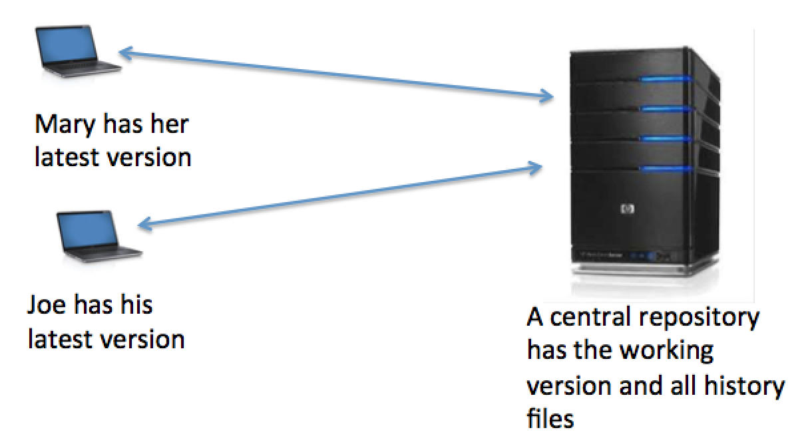 

If Pete, the new programmer, joins the team, he'd need to check out the latest code from the central repository and start making his code modifications on his computer. There are many centralized VCS, and some the most popular are CVS, SVN, and Perforce.

Distributed VCS store the latest version of the code as well as all historical files _on each_ programmer's computer. Popular distributed VCS are Git, Mercurial, and Bazaar. Technically, if you work alone, you can install Git on your computer and have your private VCS without using any remote server as a shared repository. But again, having an extra copy of your project files on a remote server is always a good idea. 

Programmers usually work in teams, so the following diagram shows three computers - one shared repository on the right and to local repositories (Mary's and Joe's) on the left. 

[[FIG14-2]]
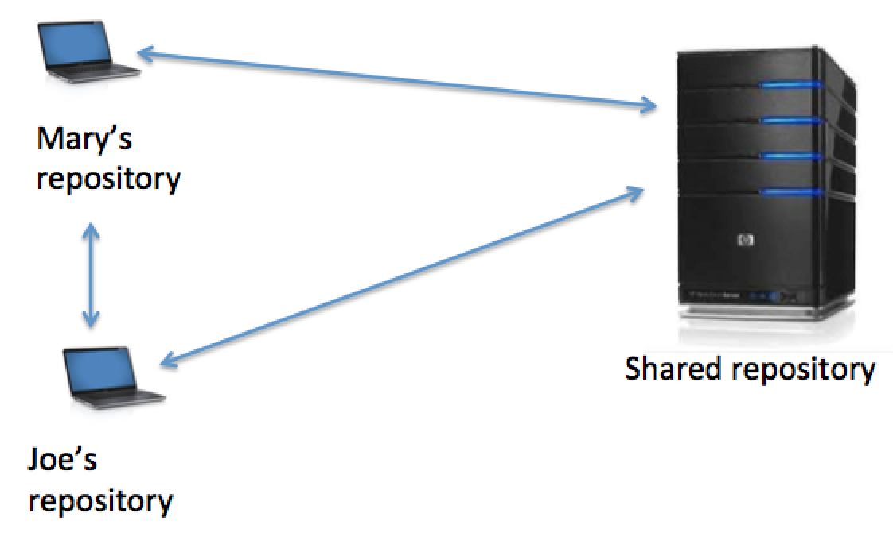 

At any given time each local repository stores the  history of all updates made by its owner as well as historical updates that the owner pulled from the shared repository. Let's see how to create a source code repository of your computer that's managed by Git.

=== Introduction to Git

Git is a free distributed VCS, which you can download and install from http://git-scm.com[http://git-scm.com]. There is a chance that your computer already has Git installed, and you can check it out by opening a Command or Terminal window and entering the command _git_. If it prints a list of available Git commands, you already have Git installed. But still, I'd suggest to install the latest Git version by following http://git-scm.com/book/en/v2/Getting-Started-Installing-Git[these instructions] for your operational system. 

There are several http://git-scm.com/download/gui/linux[GUI tools] for working with Git repositories, but we'll be using a Command or Terminal window for executing all commands. After the installation is complete, enter the command _git --version_, and you'll see which version of Git you'll be using.  

==== Introducing Yourself to Git

The next step is to introduce yourself to Git by providing your name and the email address. Typically you'll be running the _git_ program followed by the command name, which may have various options that start with _--_ or _-_. To introduce yourself to Git, use the _config_ command with the _--global_ option. This is how I did it:  
 
[source, html]
----
git config --global user.name ”Yakov Fain" 
git config --global user.email "yakovfain@gmail.com"
----

NOTE: If you want to be able to use different user names and emails for different projects, run the above commands from the project directory without the _--global_ option.

Later on, when you'll be opening a GitHub account you'll need to use the same email as you used with the _config_ command above. Git is ready to manage your projects. Now let's create a Git repository for a simple project and learn how to work with it.

=== Creating a New Git Repository

For illustration purposes I'll create a new folder called _gitIntro_ and will copy there the files _Pet.java_, _Fish.java_, and _PetMaster.java_ from Chapter 3. Then I'll  open the Terminal window on my MacBook (Windows users open the Command window) and will create a new Git repository by entering the command _git init_. The content of my _gitIntro_ folder looks as follows:

[[FIG14-3]]
image::images/fig_14_git_init.png[] 

The _git init_ command has created a hidden directory called _.git_, which is a Git repository for my _gitIntro_ project. This directory contains a Git database (a.k.a the index) that will store all the changes I'll be making to my Java classes through the life of this project.

You can start using Git with your old projects any time you want. Just open the directory of any existing project and execute the _git init_ command to create a new local repository. Of course, it won't know about your prior code modifications, but from now on you can start tracking them. 

=== Selected Git Commands

Git has a couple of dozens commands, but knowing just a half dozen of them may be enough for all your project activities. I'll show you several commands that I use daily. Each command may be issued with several options. I'll just show you the basic commands to quickly get you started with Git. For more detailed coverage of all Git features and commands you'll need to study http://git-scm.com/doc[online documentation]. 

Typically, my work with Git-controlled projects consists of the following activities:

1. Make the changes to some project files.
2. Check the status of the files in my project.
3. Change the status of all or some of the modified files to trackable by running the _add_ command. 
4. Commit all or selected modified files to local Git repository.
5. Push the changes to a shared remote code repository.
6. Repeat.

==== The status Command

I always start working with Git by opening my project directory and typing _git status_ to see which files I've modified since the last time I've committed the changes to Git repository. Let's do it in the directory _gitIntro_. I havn't committed any files to my brand new code repository just yet, and Git will respond with the following status:

[[FIG14-4]]
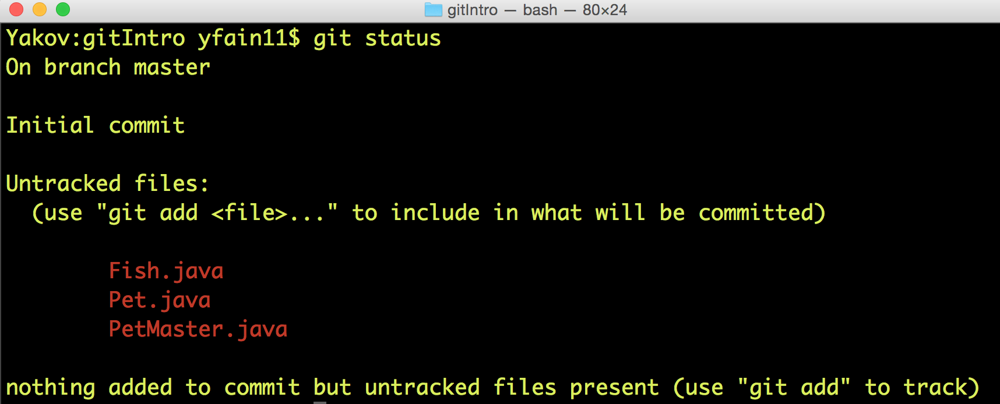 

Note the first statement indicates that I work with the code branch called _master_. I'll explain how and why create separate code branches a bit later, but for now I have no other branches. The untracked files are displayed in red, which means that they are either new to Git or have been modified after the last commit to the repository. The changes made to the untracked files are not stored in the Git database.

==== The add Command

Adding files to a Git repository is done by the command _add_, which is easy to understand to the process of adding toys to a shopping cart in a toy store. There are lots of toys on the shelves, but you pick only selected ones by placing them into your cart. 

[[FIG14-4-1]]
image::images/fig_14_ToyStore.png[]

Similarly, you have lots of files in your project's folder(s), but you may want to add only selected ones to the git repository, for example _git add Fish.java_. We call the modified files that must be saved in the Git database _trackable_, and those the should be ignores - _untracked_.

NOTE: If you want to know which options exist for any Git command, just enter _git --help_ followed by a command name, for example, _git --help add_. To quit the help mode just enter the letter _q_ in the Command window.

You can also add all new or modified files in one shot by executing the command _git add --all_. After running this command you'll get the following output:

[[FIG14-5]]
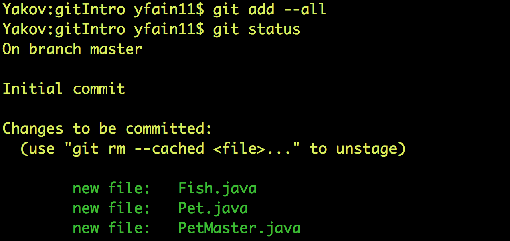

Now all my Java files are shown in green, which means that these files became trackable and are ready to be committed to the Git database.

.NOTE
********
You shouldn't store compiled Java classes or JARs in the source code repositories. You can let Git know which files to ignore by creating a text file named _.gitignore_ in your project directory. Then add there the types of files that Git should ignore. For example, if you'll add the following two lines to your _.gitigore_ file, coompiled classes and JARS won't be included in your Git database:

[source, html]
----
*.class
*.jar
---- 
********

==== The commit Command

If we'll continue using the analogy with a toy store, committing is similar to paying for the toys that you placed in your shopping cart. But when you pay at the cash register, you get a receipt, right? On the same note, when you issue a _commit_ command, you need to write a comment about what are you committing. Programmers make multiple commits over the life of each project, and such comments allow to keep tracks of the code changes. For example, you can issue the following command:

[source, html]
----
git commit -m "initial commit of the classes Fish, Pet, and PetMaster". 
----

The _-m_ option allows writing a short message in double quotes describing the commit. 

[[FIG14-6]]
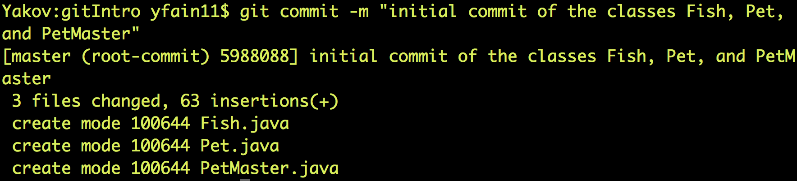

The "63 insertions" means that total of 63 lines were inserted in the Git database. 

If you would run the _git commit_ command without any options, Git would open a text editor where you should enter a detailed description of changes being committed. Saving this file will store this description in the Git database.

Enter the command _git status_ again, and you'll see the "nothing to commit" message. No wonder, I just committed three files and haven't modified them again just yet. 

[[FIG14-7]]
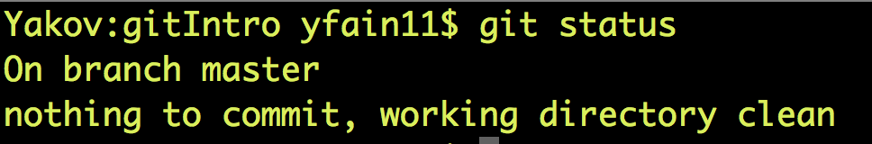

Now let me make a small change in the file _PetMaster.java_. Currently it has the following content:

[source, java]
----
public class PetMaster {

  public static void main(String[] args) {

    String petReaction;
    Pet myPet = new Pet();
    myPet.eat();

    petReaction = myPet.talk("Tweet!! Tweet!!");

    System.out.println(petReaction);
    myPet.sleep();
  }
}
----

I'll just modify the comment at the top of this file. I'll change the text to "Created by Yakov on 3/28/15." Running the _git status_ command again will produce a different output:

[[FIG14-8]]
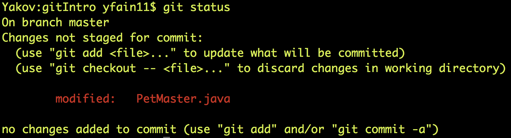

Git has noticed that the file _PetMaster.java_ has been changed, but until I issue the command _add_ for this file (or all files), Git won't track the changes in _PetMaster.java_. In the toy store setup, it's a situation when a toy is displayed on the shelf, you noticed it but have not added to your shopping cart yet. The following two commands will save my latest change in the Git database:

[source, html]
----
git add PetMaster.java
git commit -m "Modified the opening comment in PetMaster.java"
----

After committing all the changes _git status_ will tell us again that there is nothing to commit, and the working directory is clean. 

To summarize, we have three Java classes located in the working directory _gitIntro_, and the history of modifications and commits is stored in the directory _.git_. I'd like to remind you that all the work we've done so far was saved only in the local code repository.

==== The reset Command

Here's another scenario to consider. I've just committed the changes to the file _PetMaster.java_ and... got goose bumps. Suddenly I realized that it was a mistake, and I wanted to undo the last commit. The file _PetMaster.java_ has an opening statement "Created by Yakov on 3/28/15.", but I changed my mind and don't want to reveal my name. Luckily Git stores all committed code changes (the deltas) in its database. 

I'll show you how to undo the last commit and remove the code changes in _PetMaster.java_. When you'll be trying to repeat all these commands open the file _PetMaster.java_ and note the text of its opening comment, because it's going to change right after the _reset_ command:

[source, html]
----
git reset HEAD
----

The _reset_ command will undo the last commit and will open a text editor containing the description of this  reverted commit, which can look as follows:

[source, html]
----
Revert "modified the opening comment in PetMaster.java"

This reverts commit 6e18f1c5f437650c1a115c9875403fb9d081f15d.

# Please enter the commit message for your changes. Lines starting
# with '#' will be ignored, and an empty message aborts the commit.
# On branch master
# Changes to be committed:
#	modified:   PetMaster.java
#
----

You can change this text to better describe what has been done by this _reset_ command. Git will store the saved message in its history files. The 40-character long sequence of digits and letters is a unique code associated with each commit. 

NOTE: If you want to see the history of all commits, use the command _git log_.

So far we've been working with the default branch called _master_, and now I'll explain you what branches are for.

==== Code Branching 

What if Mary wants to add a new feature to the application, but she's afraid that her new code may introduce bugs in the application? She doesn't want to modify the code that other programmers may rely on. Joe works on adding another feature and he also wants to keep his code separately. There is a solution to this - both Mary and Joe can create their own branches to keep the new code being developed separately from the _master_ branch, which has tested and working code. 

Let's see how Mary can create a separate code branch and add a new method `surface` to the class `Fish`, which currently looks like this:

[source, java]
----
public class Fish extends Pet {

  int currentDepth=0;

  public int dive(int howDeep){

      currentDepth=currentDepth + howDeep;
      System.out.println("Diving for " +
              howDeep + " feet");
      System.out.println("I'm at " + currentDepth +
              " feet below sea level");

      return currentDepth;
  }
}
----

Mary will be running all branching commands in the same directory _gitIntro_. First, she'll create her own branch called _mary_:

[source, html]
----
git branch mary 
----

The new branch will be created in the Git database, but Mary remain in the _master_ branch until she switches to the new branch by executing the _checkout_ command:

[source, html]
----
git checkout mary 
---- 

The _git status_ command is our friend. Mary uses it often to make sure that she works in the proper branch:

[[FIG14-9]]
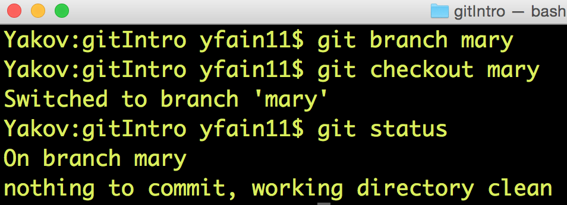

You can also print the names of all branches that exist in your Git repository by running the command _git branch_. The current branch will be shown in green and marked with an asterisk.

Now Mary adds the following method to the class `Fish`:

[source, java]
----
public void surface(){
  System.out.println("Going up " + currentDepth + " feet.");
}
----

Using the usual sequence of commands _status_, _add_, and _commit_ Mary commits the changes to the branch _mary_:

[[FIG14-10]]
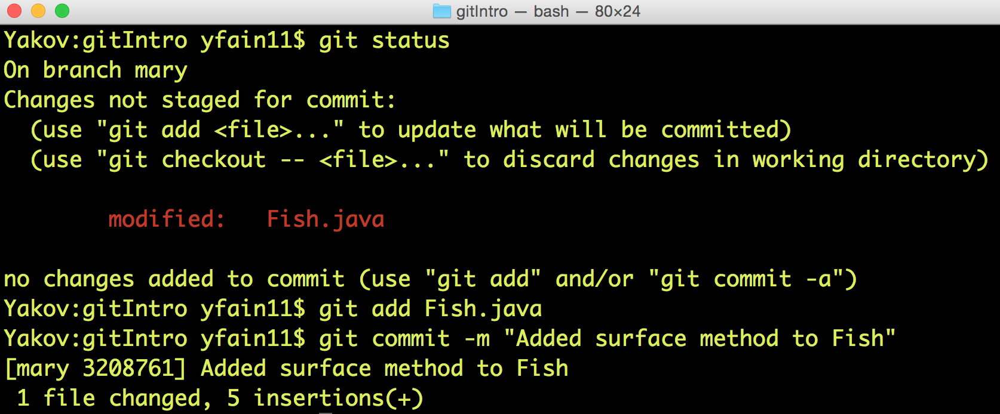

At any given time the working directory will have only one copy of each file with the content that correspond to the current branch. Hence the class `Fish` from the branch _mary_ has the method `surface`. Now Mary  switches back to the branch _master_ by running _git checkout master_ and opens the file _Fish.java_ - the method `surface` isn't there! Git seamlessly moved the older version of _Fish.java_ from its database back to the working directory. It happened really fast, because in the distributed VCS the complete code repository is located on the programmers computer and there is no need to do any communication over the network.

Mary tested the new version of the class `Fish` and she's ready to include it in the _master_ branch. Using the VCS terminology, she wants to merge the code located in the branch _mary_ into the code in the _master_ branch. From the _master_ branch Mary runs the following _merge_ command:

[source, html]
----
git merge mary
----
Here's how it may look in the Terminal window:

[[FIG14-11]]
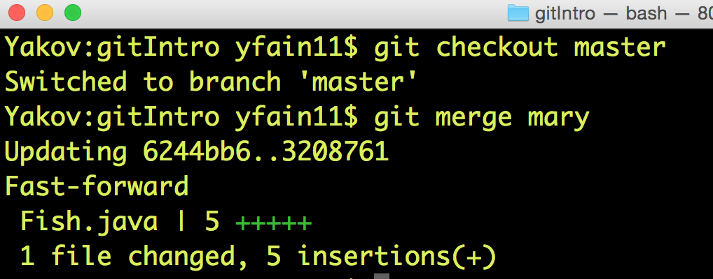

In this case Git was able to automatically merge two versions of the file _Fish.java_. But sometimes the changes are conflicting with each other and manual editing is required to resolve the conflicts. 

==== Conflict Resolution

Since Mary was the only programmer working with the file _Fish.java_ Git just kept track of all insertions, deletions, and changes and re-applied them to the older version of the file during the merge. But when more than one programmer works on the same file they could accidentally modify the same piece of code in different branches. This may cause merge conflicts, and Git will mark the code fragments that need to be merged manually.

I'll illustrate this by creating conflicting changes on purpose. First, I'll add three exclamation marks in the method `surface` in the _master_ branch:

[source, java]
----
System.out.println("Diving for " + howDeep + " feet!!!");
---- 

I'll commit the changes to the _master_ branch, then switch to the branch _mary_ and add the question marks there in the same place where exclamations were placed in _master_. So in the branch _mary_ this line will look like this:

[source, java]
----
System.out.println("Diving for " + howDeep + " feet???");
---- 

Now I'll switch back to _master_ branch and will try to do a merge. Clearly Git can't take a responsibility in picking one version over the other. We got a conflict:

[[FIG14-12]]
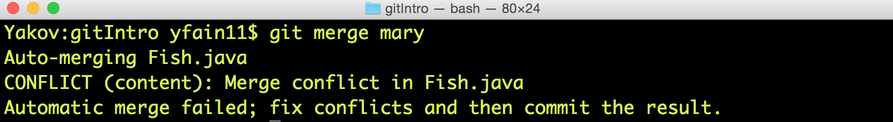

If you'll open the file _Fish.java_ you'll find some duplicate code with marked with special tags:

[source, java]
----
    public void surface(){
        System.out.println("Going up " + 
<<<<<<< HEAD
        	    currentDepth + " feet!!!");
=======
        	    currentDepth + " feet???");
>>>>>>> mary
}
----

The conflicting code section marked as _HEAD_ corresponds to the version in the _master_ branch, and the other one is from _mary_. Now you need to manually edit the file _Fish.java_ to keep the version of the conflicting line of code that you like. Commit the changes to the _master_ branch and the conflict is resolved. 

NOTE: You can find more detailed explanations of all Git features in the free book titled http://git-scm.com/book/en/v2[Pro Git] published by Apress.

=== Publishing Your Code on GitHub

If you have a shared Git repository on a remote computer, you'll need to synchronize with is the content from your local Git repository. Usually I do it several times a day. Even if you work on the project alone, you may want to have a current copy of your Git repository in the remote computer.

https://github.com/[GitHub] is a Web-based Git repository hosting service, where you can create a shared code repository free of charge as long as you don't mind keeping your code open to the public. People or organizations that want to create private repositories on GitHub can purchase a paid account. But we have nothing to hide. Moreover, programmers who have their code published on GitHub are treated with additional respect.

NOTE: GitHub is not the only hosting service for Git repositories on the Web. https://bitbucket.org/[Bitbucket] is yet another popular place for storing public and private Git repositories.  

==== Creating a GitHub Repository

To be able to publish your Git repository on GitHub, you need to create an account there. Visit the Web site https://github.com/[https://github.com] and sign up for it. You'll need to pick a user name for yourself and enter the email, which should be the same as you've used with  the _git config_ command (see the section Introducing Yourself to Git). GitHub will send you a verification  email to this address, and you'll need to respond to it. For illustration purposes I've created a new GitHub account with the user ID _java4kids_. 

After creating a free account you'll see a green button titled "+ New repository". Click on it and enter the name and description of your project. Since our goal is to publish the files from the local directory _gitIntro_, I'll use the same name for my GitHub repository. As you see in the following screen shot, I've entered the repository name and its description:

[[FIG14-13]]
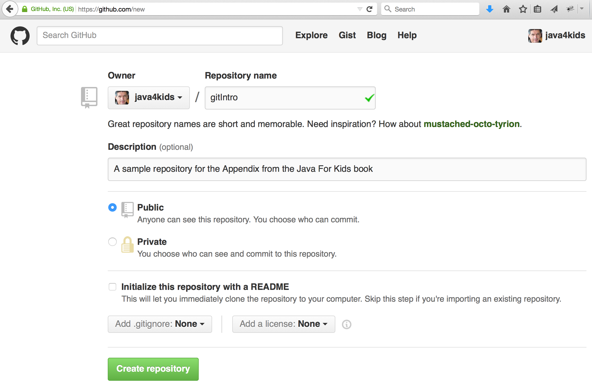

Pressing the button titled "Create Repository" and an empty repository is ready. The GitHub will show you the following page with short instructions on how to upload your code there.

[[FIG14-14]]
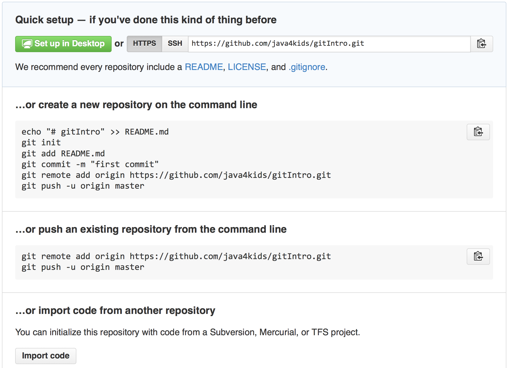

Note the HTTPS URL of this repository on top. It's used for cloning that's described later. 

==== Pushing the Local Repository to GitHub

Since we already have an existing repository in the directory local directory _gitIntro_, we'll need to go there in the Command or Terminal window and enter the suggested commands:

[source, html]
----
git remote add origin https://github.com/java4kids/gitIntro.git   // <1>
git push -u origin master                           // <2>
---- 

<1> When a remote repository is created, it gets a name, which by default is _origin_. So the first command adds a URL of the newly created origin to the configuration of your Git project. The name _origin_ serves as an alias name to that long GitHub URL.

<2> The Git _push_ command uploads the local code to the remote repository. So you commit changes to a local Git repository, and push them to the remote one. Accordingly, the second command uploaded my Git-managed repository to GitHub. The _-u_ option means upstream. You'll use it with the first push to link you local repository to the the remote one. Subsequent _push_ commands will be issued without the _-u_ option. 

[[FIG14-14-1]]
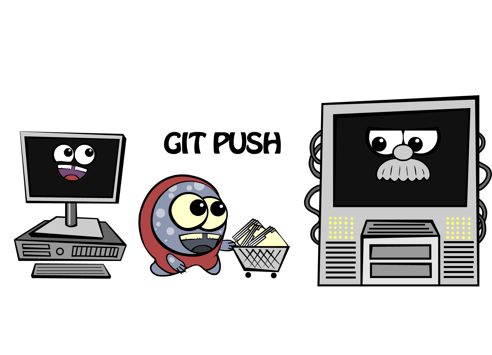

After running these commands the code and the Git database from my local directory _gitIntro_ is published on GitHub. Now if you or anyone else will visit the URL https://github.com/java4kids/gitIntro[https://github.com/java4kids/gitIntro], they'll see the Web page that looks similar to this:

[[FIG14-15]]
image::images/fig_14_github_pushed.png[]

==== Pulling The Latest Version from GitHub

The _pull_ command downloads and merges the latest code from GitHub to your computer. 

[[FIG14-15-1]]
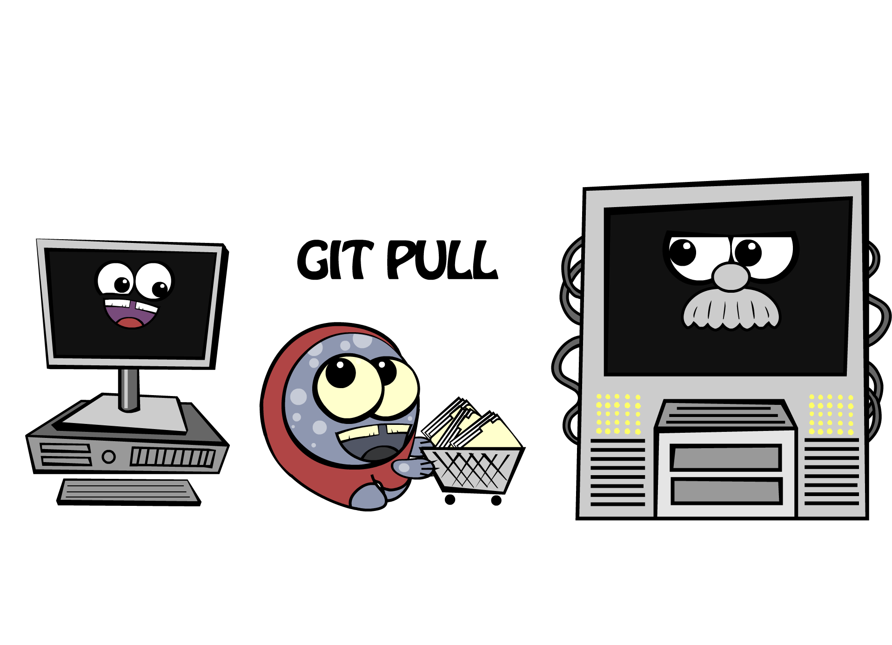

If you work alone on the project, you won't use the _pull_ command that much, because no one else is pushing the code changes there. You'll be repeatedly running the following sequence of git commands: 

* _add_  - to make the files trackable
* _commit_ - to commit changes in the local Git repository
* _push_ - to upload files to the shared repository

But as soon as someone else will join the project, you'll need to run the _pull_ command periodically to make sure you have the latest version of the code that includes all the changes made by other team members, which are called _collaborators_, e.g. our friends Mary and Joe are collaborators.

To add a collaborator to your GitHub project, you'd need to visit you shared project repository on GitHub (e.g. https://github.com/java4kids/gitIntro), click on the Setting icon on the right and use the Collaborators link on the next Web page. Of course, this new collaborator must be registered on GitHub and have an ID. This process is described step-by-step in https://help.github.com/articles/adding-collaborators-to-a-personal-repository/[GitHub documentation].

==== Cloning  

Say, Peter joins the existing project and Joe and Mary want him to get the latest code installed. Peter will also use Git and GitHub, so he needs to install Git on his computer, but Peter doen't have to create a new folder and run the _git init_ command there. Git has a _clone_ command that can take the existing code from a  shared repository and create its copy on Peter's computer. The _clone_ command downloads the latest project's code including the entire Git database with all the history of changes made by Joe and Mary in the past. You can do cloning either by clicking the button "Clone in Desktop" on GitHub or by running _git clone_ in the Command window.

While writing this book I stored all its code examples on GitHub at https://github.com/yfain/Java4Kids_NoStarchPress_code[https://github.com/yfain/Java4Kids_NoStarchPress_code]. You can clone my Git repository from GitHub and start using, improving, or adding new code samples. Just visit the above Web page and copy the URL from the box HTTPS clone URL on the right hand side:

[[FIG14-16]]
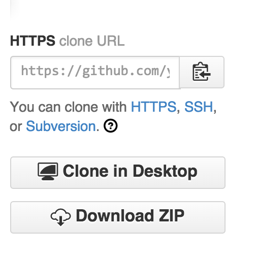

You can see only a part of this URL, but when you copy it into the clipboard it'll look like this:

[source, html]
----
https://github.com/yfain/Java4Kids_NoStarchPress_code.git
----

Now open the Command (or Terminal) window and run the _clone_ command using the above URL as parameter:

[source, html]
----
git clone https://github.com/yfain/Java4Kids_NoStarchPress_code.git
----

In a couple of seconds you'll find in your computer the directory _Java4Kids_NoStarchPress_code_ with all code samples and the _.git_ folder inside. This is how I did it on my Mac computer:

[[FIG14-17]]
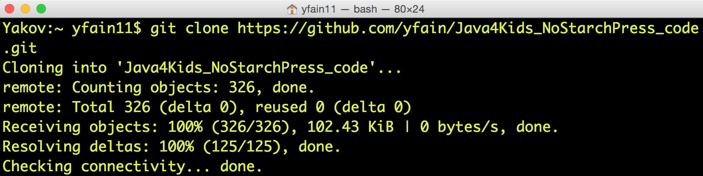

As a matter of fact you can clone any GitHub open source repository on your computer and work with the code without even notifying the author of the code. But creating a clone doesn't mean that you can push your code changes back to the author's GitHub repository without his approval. GitHub has special procedures for this called Forking and Pull Requests.

==== Forking and Pull Requests

If cloning creates a copy of someone's remote repository on your computer, forking creates a new GitHub repository from the existing one. If you fork a project on GitHub, you can clone this project from your own GitHub account, and work with it as if it's yours. Then if you want to contact the author offering your version of the code, you need to send a _pull request_ to the author. By creating a pull request you are saying to the author, "I just improved your code and committed it into my repository. Please look at it and pull it from my repository if, you like it". 

Say you want to be a contributor to my code samples for this book. Instead of cloning explained in the previous section, just go to the GitHub page of my project and click on the button Fork at the top of the page:

[[FIG14-18]]
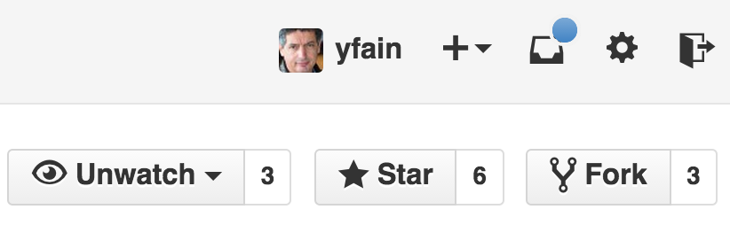

This will create a new repository under your GitHub account and will copy my code there. Then you can clone this project from your repository and work with it. When you've improved my code or fixed a bug, push it to your forked project. Then visit my GitHub page and press the button Pull Request there:

[[FIG14-19]]
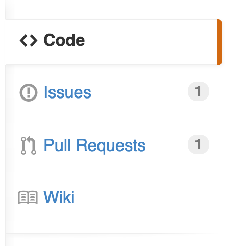

You'll be able to create a pull request and describe the code change that you've already implemented and committed into the forked repository. Actually, I have one pull request at the time of this writing. Let's click on this little circle with the digit 1 and see what's there:

[[FIG14-20]]
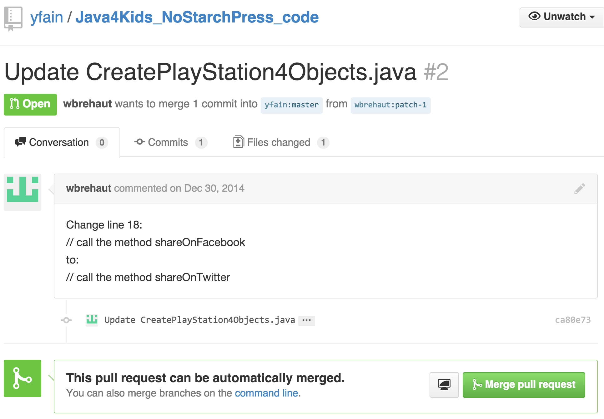

The user with the ID _wbrehaut_ found a typo in my file _CreatePlayStation4Objects.java_. After looking at the code in this file I saw that it's a typo indeed, and pressing the green button "Merge pull request" will automatically merge the correct line into my code.

The following diagram illustrates the forking and pull request processes:

[[FIG14-21]]
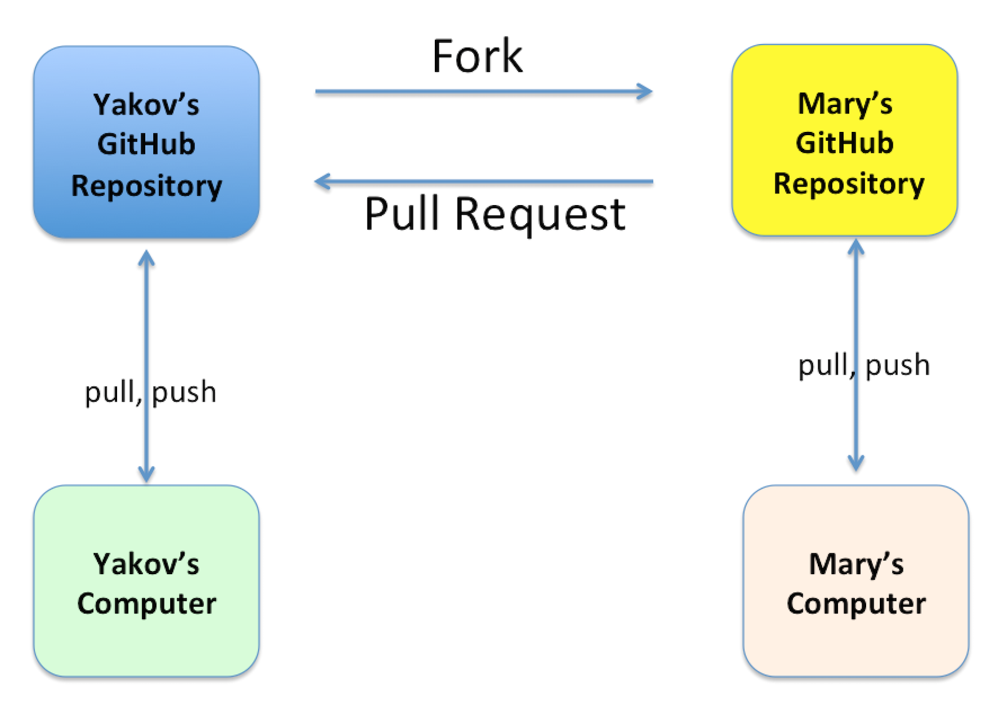

Not every pull request can be automatically merged, especially if multiple code changes have been done. In this case you'd need to do a manual merge right in the GitHub. I always leave a Thank You comment to people who helped making my code better. 

==== Cloning From IntelliJ IDEA

All popular Java IDE support working with Git. In IDEA open the menu VCS and select the menu item Checkout from Version Control and then GitHub as shown below.

[[FIG14-22]]
image::images/fig_14_IDEA_vcs1.png[]

IDEA will ask you to login to GitHub. Use the email and the password that you used while creating your GitHub account. Then IDEA will ask you for its own password database - leave it blank. Now IDEA is ready to clone any public repository provided that you know the clone URL, which is https://github.com/yfain/Java4Kids_NoStarchPress_code.git in our case. You should enter this URL in the next window that may look similar to this one:

[[FIG14-23]]
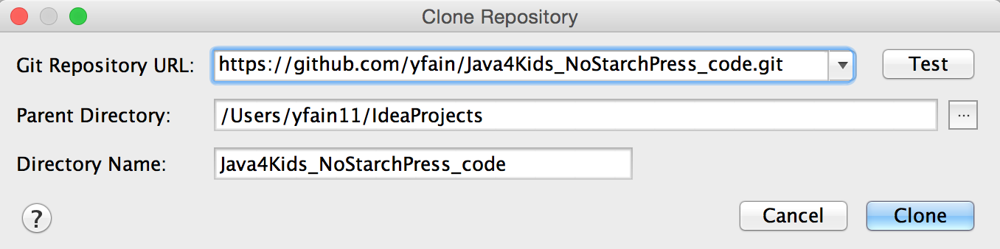

The field with the name of the project directory will be populated automatically, but you can change it if you want. Press the button Clone and IDEA will clone all the projects into the specified directory and will ask you if you want to open a project. Selecting Yes will open one of the IDEA projects (e.g. Chapter7). You'll also see a warning about unregistered VCS root, which you can ignore, as you won't be directly pushing any code changes into my GitHub repository.

If you'll open the project directory with File Manager (or Finder), you'll see there other folders that contain code samples for all the chapters. You can open any of these projects in IDEA by selecting the menu File | Open. 
Note that this project directory has a folder named _.git_, which contains Git database with the history of all commits that I did while writing code samples for this book.

If you see any compilation errors, open the menu File | Project Structure and make sure that the project language level is set to "8 - Lambdas, type annotations etc."

IntelliJ IDEA fully supports Git, so you can run all Git commands without the need to use the Command window. You can find the description of Git support in the https://www.jetbrains.com/idea/help/using-git-integration.html[IDEA documentation].

=== Epilogue

This book is over. I hope you've enjoyed reading it as much as I enjoyed my writing. Your process of studying Java is far from being over. If you liked this book and want to continue your Java journey, consider reading my other Java book for adults, which is called "Java 24-Hour Trainer", 2nd Edition, Wiley. That book comes with videos that illustrate the materials covered in each chapter. I also explain the server-side programming in Java there.   
Maybe one day I'll write a more advanced Java book for kids too. Thank you for reading my book, and good luck!