:toc-placement!:
:imagesdir: ./

== Chapter 10. Creating a Tic-Tac-Toe Game  

In this chapter we'll return to GUI programming and will  develop a Tic-Tac-Toe game using JavaFX and Scene Builder.

This game may go by different names around the world, but it comes down to placing X's and O's on the game board. If you're not familiar with this game, read its description in  http://en.wikipedia.org/wiki/Tic-tac-toe[this Wikipedia article]. 

Every game implements a set of rules or a strategy that has to be applied depending on the player’s actions. Let’s come up with a simple algorithm for the Tic-Tac-Toe game. Our version of this game will implement the following rules:

* The game will be played by two players on a 3x3 board.
* Two players can play this game. One will play with the symbol X, and the other will use O.
* The winner must have a full row, column, or diagonal of X's or O's.
* After each move, the program has to check if there is a winner.
* The winning combination of squares has to be displayed in different colors.
* After the winner is found or there is no empty squares left the players may select the menu  Actions | Play to play again.
* In a new game the first player plays with X's.

[[FIG10-1]]
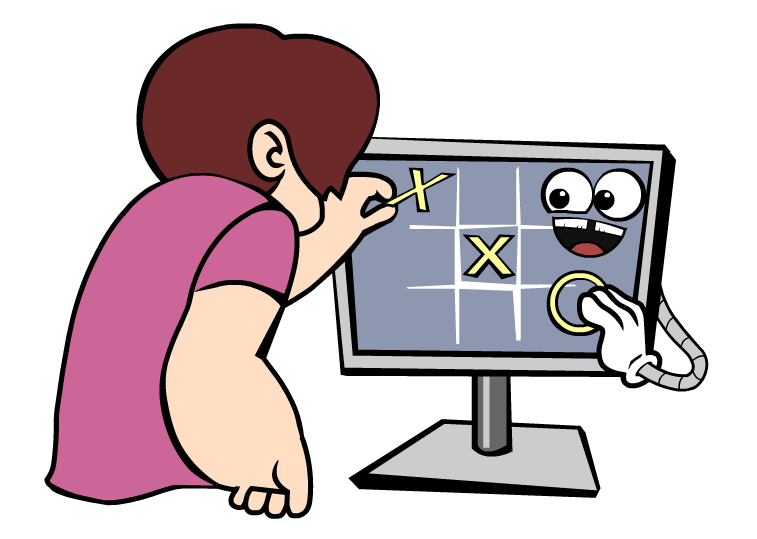
 
The content of this chapter is based on the materials covered in Chapter 7 and 8. While developing the game you'll learn how to add menus, dynamically change styling of GUI components and apply an animation effect.  

=== Developing the Game: Step by Step

In Chapter 7 we went through the procedure of creating a new IDEA project, and now you'll need do it again. Create a new project selecting JavaFX as a project type. Press Next, and on the next popup window enter _TicTacToe_ as a project name. Press the button Finish and IDEA will generate a new project for you. Rename (right-click | Refactor | Rename) the file _sample.fxml_ into _tictactoe.fxml_ and _Main.java_ into _TicTacToe.java_. Accordingly, the `TicTacToe` class should load the file _ticktacktoe.fxml_, and the window title should read `Tic-Tac-Toe`:

[source, java]
----
public class TicTacToe extends Application {

    @Override
    public void start(Stage primaryStage) throws Exception{
        Parent root = FXMLLoader.load(getClass().getResource("tictactoe.fxml"));
        primaryStage.setTitle("Tic-Tac-Toe");
        primaryStage.setScene(new Scene(root, 300, 275));
        primaryStage.show();
    }

    public static void main(String[] args) {
        launch(args);
    }
}
----

Rename the generated package from _sample_ into _mygame_. Inside the _tictactoe.fxml_ change the reference to controller to be `fx:controller="mygame.Controller"`. Now you're ready to design the GUI for Tic-Tac-Toe in Scene Builder.

==== Developing the GUI part in Scene Builder

Similarly to the examples from Chapter 7, we'll separate the GUI design from implementation. So right-click on the file _tictactoe.fxml_ and select the menu option Open in SceneBuilder. This is how the IDEA-generated file _tictactoe.fxml_ looks like in Scene Builder:  

[[FIG10-2]]
.Opening the generated tictactoe.fxml in Scene Builder
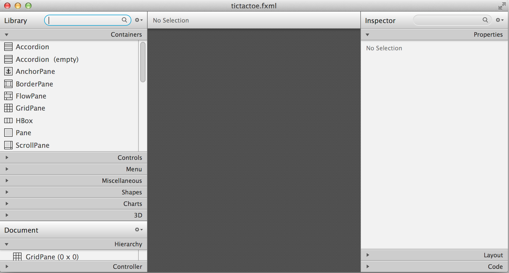

Firs of all, the `<GridPane>` is not a good candidate to serve as a root container for our game, which has to have a menu on top. The `<BorderPane>` is a better choice when you need to have some GUI components to be located on the top of the window. Our game will have a menu on top and a 3x3 grid of squares in the center of the window.

Let's delete the `GridPane` from the Hierarchy panel at the bottom left and drag-drop the `BorderPane` there. The Scene Builder's Window should look like this:

[[FIG10-3]]
.The BorderPane is a root container
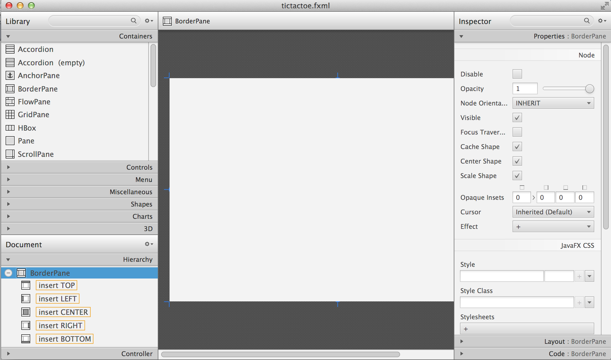

JavaFX menus are created as a hierarchy of nested components. A `Menu` container can contain one or more `MenuItem` components and other `Menu` components. You can also create a `MenuBar` or a `ContextMenu` that include one or more `Menu` components. I'll show how to create a menu bar with two menus _Actions_ and _Help_ for our Tic-Tac-Toe game. 

A menu bar is usually located at the top of a window. In Scene Builder drop the `MenuBar` component from the Controls panel onto `Insert TOP` line in the `BorderPane` at the bottom left panel. Press a little plus sign to expand the `MenuBar` in the Hierarchy panel. You'll see that it'll have the default menus named File, Edit and Help. 

[[FIG10-4]]
.Dropped the MenuBar on Top of the BorderPane
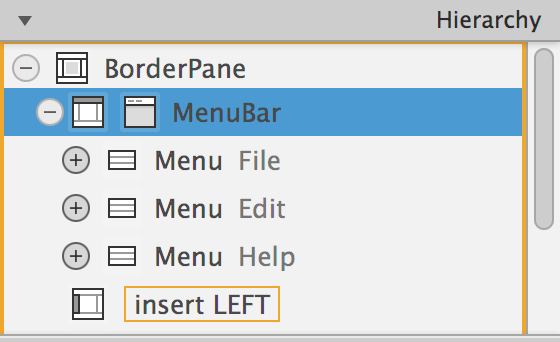

We're not going to edit anything in the TicTacToe game, so right-click on Edit and select Delete option. Rename the menu File into Actions using the Properties panel of Scene Builder.The `Menu` File was created with the `MenuItem` Close - rename it into Quit.

Now we'll add menu items to the menus Actions and Help. Drop a `MenuItem` component from the panel Menu onto the menu Actions in the Hierarchy panel. Scene Builder will automatically create Unspecified Action. Rename it into Play. you can use drag and drop to change the order of the menu items.

Drop another `MenuItem` component onto the menu Help. Scene Builder by default creates two menu items:  About and Unspecified Action. Rename the latter to be How to Play. The Hierarchy panel should look as follows:

[[FIG10-5]]
.The menu bar with 2 menus and 4 menu items
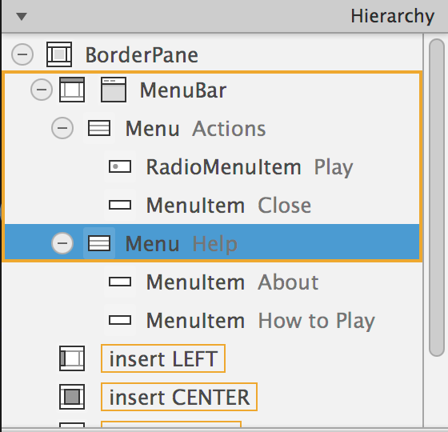

Now drop a `GridPane` from the Containers panel onto the center of the BorderPane. By default, Scene Builder creates a 2x3 grid. Right-click at the column tab "1" and add a column to change the grid dimensions to be 3x3. 

Change the preferred height of each row to 100 by selecting each row and entering 100 in the Pref Height field on the right panel named Layout: RowConstraints. This is what we've got so far:

[[FIG10-6]]
.The menu bar on top and the grid in center
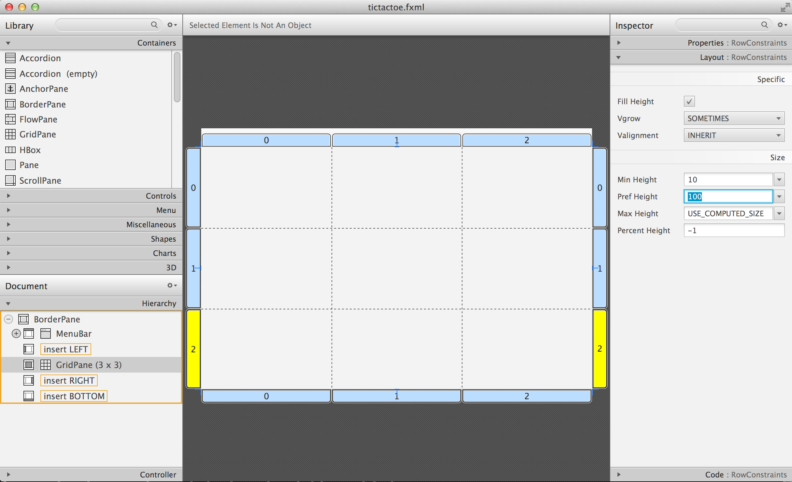

Save this layout in Scene Builder and run the TicTacToe class in IDEA. You'll see a window with a menu on top. The grid won't be visible yet, because it has no content. Click on the menu Actions, and the window will look like this:

[[FIG10-7]]
.Running TicTacToe with an empty grid
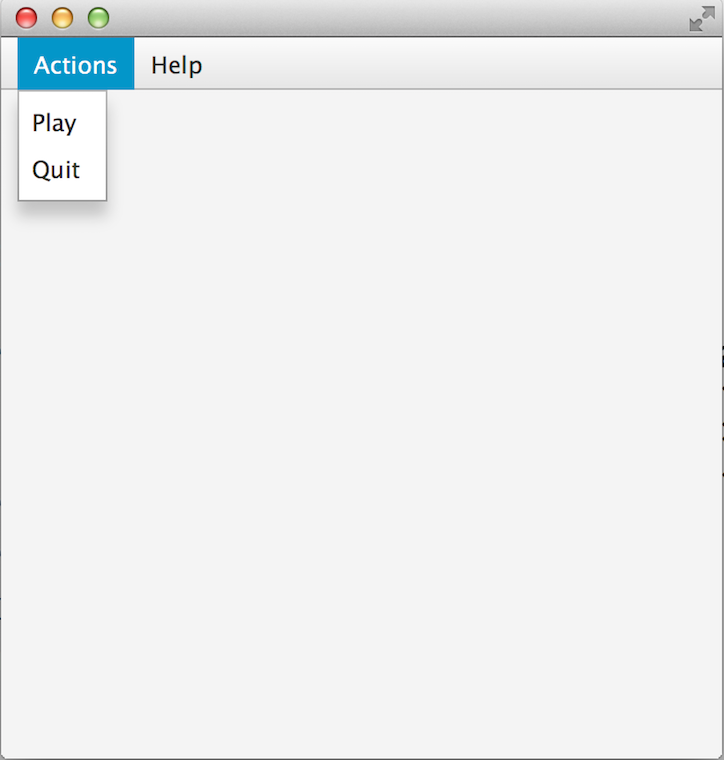

The grid has 9 cells and we want to add 9 buttons - each button will represent a square on the Tic-Tac-Toe board. You can add the buttons to the grid in Scene Builder as we did in the Calculator in Chapter 7. But it'll be faster to do it manually in by editing the content of the file _tictactoe.fxml_ in IDEA's editor. Modify the content of this file to look as follows:

[source, xml]
----
<?xml version="1.0" encoding="UTF-8"?>

<?import java.lang.*?>
<?import javafx.scene.control.*?>
<?import javafx.scene.layout.*?>
<?import javafx.scene.layout.BorderPane?>

<BorderPane xmlns="http://javafx.com/javafx/8" 
            xmlns:fx="http://javafx.com/fxml/1" 
            fx:controller="tictactoe.TicTacToeController">
   <top>
      <MenuBar BorderPane.alignment="CENTER">
        <menus>
          <Menu text="Actions">
            <items>
              <MenuItem text="Play" />
              <MenuItem text="Quit" />
            </items>
          </Menu>
          <Menu text="Help">
            <items>
              <MenuItem text="About" />
              <MenuItem text="How to play" />
            </items>
          </Menu>
        </menus>
      </MenuBar>
   </top>
   

      <GridPane fx:id ="gameBoard" BorderPane.alignment="CENTER">
         <children>
          <Button fx:id="b1" prefHeight="100.0" prefWidth="100.0" />
          <Button fx:id="b2" prefHeight="100.0" prefWidth="100.0"  GridPane.columnIndex="1" />
          <Button fx:id="b3" prefHeight="100.0" prefWidth="100.0"  GridPane.columnIndex="2" />
          <Button fx:id="b4" prefHeight="100.0" prefWidth="100.0"  GridPane.rowIndex="1" />
          <Button fx:id="b5" prefHeight="100.0" prefWidth="100.0"  GridPane.columnIndex="1" GridPane.rowIndex="1" />
          <Button fx:id="b6" prefHeight="100.0" prefWidth="100.0"  GridPane.columnIndex="2" GridPane.rowIndex="1" />
          <Button fx:id="b7" prefHeight="100.0" prefWidth="100.0" GridPane.rowIndex="2" />
          <Button fx:id="b8" prefHeight="100.0" prefWidth="100.0" GridPane.columnIndex="1" GridPane.rowIndex="2" />
          <Button fx:id="b9" prefHeight="100.0" prefWidth="100.0" GridPane.columnIndex="2" GridPane.rowIndex="2" />
         </children>
      </GridPane>
   

</BorderPane>
----

Note that each button has an id. We'll need them while processing button clicks in the controller class. Run the TicTacToe class and the window will look pretty close to the final version of our Tic-Tac-Toe game. 

[[FIG10-8]]
.Running TicTacToe - the first square has a focus
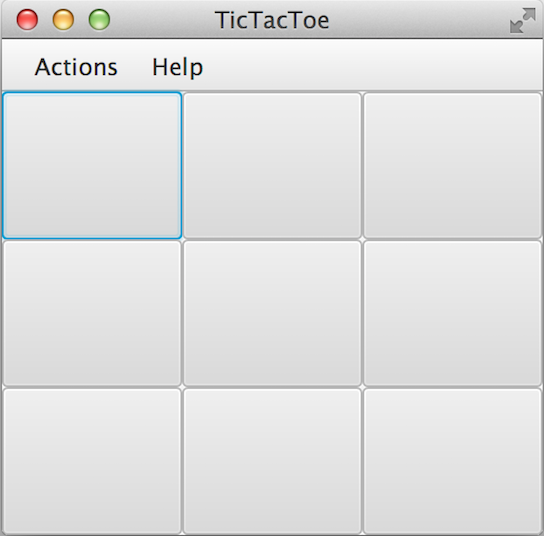

Do yo see this thin border around the top left square? It happens because by default the firs grid cell _has a focus_, which means that this particular GUI component is ready to receive input. But we don't want to suggest the player starting the game from the top left corner, do we? We want to remove this little border, and it's time to create a a special style for a button that will not show the focus.

Let's create a new file named _tictactoe.css_. In IDEA, right click on the package name _mygame_  and use the menu  File | New | File. It'll create an empty file. Type the following in there:

[source, css]
----
.button{
  -fx-focus-color: transparent;
  -fx-background-insets: -1, 0, 1, 1;
}
----

From Chapter 7 you may remember that this means that every button in our application will have these attributes. Web designers call the styles created for certain types of GUI element _type selectors_. Hence the attributes defined in the `.button` section of CSS will apply only for buttons. If we wanted to style, menus, we'd need to add a section `.menu` to the CSS file.  Labels would be styled in the `.label` section, and so on.

When I did my search on line to figure out how to remove the focus border, the online documentation suggested that adding the rule `-fx-focus-color: transparent;` would do the trick. But it didn't. Every programmer knows, that not everything works by the book. By doing a little more online research I figured out that adding `-fx-background-insets: -1, 0, 1, 1;` is needed too. 

Don't be scared that not everything works as it should from the first time. Luckily, each programming language has an online community of people who are willing to share their findings and answer the questions of the rookies. One of the best resources for asking questions and getting help is the Web site http://stackoverflow.com/[StackOverflow]. 

Now we need to add a line to the `main` method of the TicTacToe class to load the file `tictactoe.css`. We did something like this in Chapter 7 while styling the Sign In application. We'll also need to do small changes in the `main` method to keep store the reference to a `scene` in a separate variable. We also want to set fix the size of the game board by invoking _setResizable(false);_ on the stage object. After these modifications the class `TicTacToe` will look like this:

[source, java]
----
public class TicTacToe extends Application {

    @Override
    public void start(Stage primaryStage) throws Exception{
        Parent root = FXMLLoader.load(getClass()
                           .getResource("tictactoe.fxml"));
        primaryStage.setTitle("TicTacToe");
        Scene scene = new Scene(root, 300, 275);
        scene.getStylesheets().add(getClass()
            .getResource("tictactoe.css").toExternalForm());
        primaryStage.setResizable(false);
        primaryStage.setScene(scene);
        primaryStage.show();
    }

    public static void main(String[] args) {
        launch(args);
    }
}
----

Run the TicTacToe class now and the focus is gone:

[[FIG10-9]]
.Running TicTacToe - the first square has no focus
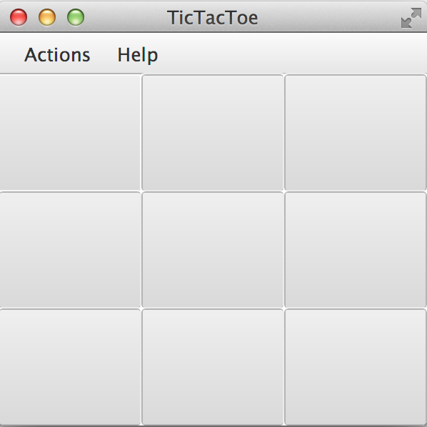

The GUI is ready. The name of the Java class that will play the role of the controller was specified in the file _tictactoe.fxml_ as `fx:controller="mygame.Controller"`. Now let's program the application logic in the controller class.

==== Handling Button Clicks in Controller

There are different ways of programming computer games. In some games you play against another player, in others - against the computer. Our version of TicTac-Toe will have two players. The first one will place X's on the blank buttons and the other one will place O's.  Hence we need to keep track of the player's number. 

When the player will click on the button, the event handler should place the appropriate label on the button. The code of the class `Controller` will take care of this functionality:

[source, java]
----
public class Controller {
   private boolean isFirstPlayer = true;
   
   public void buttonClickHandler(ActionEvent evt){
         
        Button clickedButton = (Button) evt.getTarget();
        String buttonLabel = clickedButton.getText();
        
        if ("".equals(buttonLabel) && isFirstPlayer){
            clickedButton.setText("X");
            isFirstPlayer = false;
        } else if("".equals(buttonLabel) && !isFirstPlayer){
            clickedButton.setText("O");
            isFirstPlayer = true;
        }
   }        
}
----
The method `buttonClickHandler` will handle events generated when the player clicks on a button. Note that we check if the button's label is blank, then the program displays either X or O depending on which player clicked on the button. To let the GUI know about this event handler we need to add the attribute `onAction="#buttonClickHandler"` to each `<Button>` tag in the file _tictactoe.fxml_. 
After this is done, run the `TicTacToe` program again. Start clicking on empty squares, and the program will take turns in placing the X's and O's on them.

[[FIG10-10]]
.Running TicTacToe - after 3 clicks
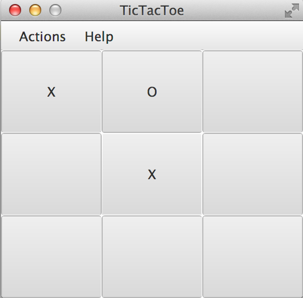

Great,the View communicates with the Controller! But the X's and O's look unproportionally small in these large squares. Besides, the gray color does not look too exciting. It's time to add some styling to our GUI components.

==== Styling Buttons and the Menu Bar 

Let's add more style attributes to the `.button` and add a new type selector for the `.menu-bar` to the file _tictactoe.css_. You can find the color names and their codes in the  https://docs.oracle.com/javafx/2/api/javafx/scene/doc-files/cssref.html#typecolor[JavaFX CSS Reference Guide]. This is what I came up with:

[source, css]
----
.button{
  -fx-focus-color: transparent;
  -fx-background-insets: -1, 0, 1, 1;

  -fx-font-weight: bold;
  -fx-font-size: 36;
  -fx-text-fill: blue;
  -fx-background-color: violet;
  -fx-border-color:darkblue;
}

.menu-bar{
  -fx-background-color: gold;
}
----

If you run the `TicTacToe` program now and start clicking on buttons, the game board will look like this:

[[FIG10-11]]
.Adding colors to the game board
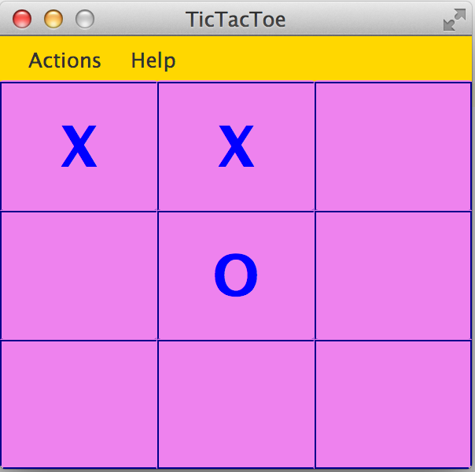

As you can see, my artistic abilities are limited, but if you spend some time learning CSS, you may come up with a lot fancier game board than mine. 

All JavaFX components are pre-styled, and the combination of the styles is called _theme_. The default theme of all JavaFX components is called caspian. By defining your own CSS rules you can override the defaults. Scene Builder has a menu View | Show CSS analyzer, which allows you to see the default styles of your GUI components. If you're interesting in learning more about styling with Scene Builder, watch the video titled https://www.youtube.com/watch?v=7Nu3_5doZK4["In-Depth Layout and Styling with the JavaFX Scene Builder"].

==== Implementing the Game Strategy

In the beginning of this chapter I've described the game strategy. We'll implement it in the `Controller` class. On each button click we need to check if there is already a winning combination of X's or O's. If there is, the program should highlight the winning combination. In case of a draw, the player may select the menu option Play to start playing again.

We'll write a method `find3InARow`, which on every click  will check each row, column, and diagonals on the board to see if they have the same labels. The method `find3InARow` will be invoked from the method `buttonClickHandler`. If the winning combination is found, the program will invoke the method `highlightWinningCombo` to show the winning combination in different style. 

To compare the labels of the buttons we need to have references to their `Button` objects, which we'll get using the injection mechanism offered by the `@FXML` annotation as we did in Chapter 8. We'll also need to have a reference to the `GridPane`, which is a container for all buttons. You'll see its use in the section "Handling the Tic-Tac-Toe Menu Play".

Each button will have a matching variable in the controller annotated with `@FXML`. The grid will also have a reference variable. We'll just add the following member variables to the `Controller` class:

[source, java]
----
@FXML Button b1; 
@FXML Button b2;
@FXML Button b3;
@FXML Button b4;
@FXML Button b5;
@FXML Button b6;
@FXML Button b7;
@FXML Button b8;
@FXML Button b9;   

@FXML GridPane gameBoard;
----

Now let's write the method `find3InARow` that will methodically compare the non-blank labels of the buttons in each row, column, and both diagonals. If three labels are the same, the code should highlight the winning combination. This is how the code in the method `find3InARow` will look:

[source, java]
----
private boolean find3InARow(){
       //Row 1
       if (""!=b1.getText() && b1.getText() == b2.getText() 
           && b2.getText() == b3.getText()){
           highlightWinningCombo(b1,b2,b3);
           return true;
       }
       //Row 2
       if (""!=b4.getText() && b4.getText() == b5.getText() 
           && b5.getText() == b6.getText()){
           highlightWinningCombo(b4,b5,b6);
           return true;
       }
       //Row 3
       if (""!=b7.getText() && b7.getText() == b8.getText() 
           && b8.getText() == b9.getText()){
           highlightWinningCombo(b7,b8,b9);
           return true;
       }
       //Column 1
       if (""!=b1.getText() && b1.getText() == b4.getText() 
           && b4.getText() == b7.getText()){
           highlightWinningCombo(b1,b4,b7);
           return true;
       }
       //Column 2
       if (""!=b2.getText() && b2.getText() == b5.getText() 
           && b5.getText() == b8.getText()){
           highlightWinningCombo(b2,b5,b8);
           return true;
       }
       //Column 3
       if (""!=b3.getText() && b3.getText() == b6.getText() 
           && b6.getText() == b9.getText()){
           highlightWinningCombo(b3,b6,b9);
           return true;
       }
       //Diagonal 1
       if (""!=b1.getText() && b1.getText() == b5.getText() 
           && b5.getText() == b9.getText()){
           highlightWinningCombo(b1,b5,b9);
           return true;
       }
       //Diagonal 2
       if (""!=b3.getText() && b3.getText() == b5.getText() 
           && b5.getText() == b7.getText()){
           highlightWinningCombo(b3,b5,b7);
           return true;
       }       
       return false;
   }
----

If you'll check the `fx:id` of each button in the file _tictactoe.fxml_, you'll see that the first row is represented by the buttons `b1`, `b2`, and `b3`. The first column is represented by the buttons `b1`, `b4`, and `b7`. One diagonal consists of the buttons `b1`, `b5`, and `b9`. It should be pretty easy to read and understand the code of the method `find3InARow`, isn't it? The method `highlightWinningCombo` will get the references to the three winning buttons as the method arguments, and it has to change their styles. 

==== Highlighting the Winning Combination  

The styles of the winning buttons should be changed dynamically (during the runtime). First of all, we need to come up with the style for displaying the winning button and add it to the CSS file. Then the class `Controller` will invoke the method `setStyle` on them providing the name of the winning style.

I want to change the background of the winning buttons, but this time I won't use just a single color, but a _color gradient_. In computer graphics color gradients refer to filling the area with different colors that are smoothly transitioning from one color to another. The color transitioning can be linear or radial, and http://en.wikipedia.org/wiki/Color_gradient[this Wikipedia article] gives you some examples of both. 

We'll use radial gradients in our game. With gradients you can use more than two colors. I'll use three colors in the gradient for the winning squares. The background color will transition from white to light yellow, and then to lawn green. I'll use red for the text of the label on the winning square. 

To dynamically change the style of a GUI component you can call the method `setStyle` and specify the color as an argument, for example:

`myButton.setStyle("-fx-text-fill: red;");`

But embedding CSS rules in your Java program is not a good idea. What if you decide to change the styling (e.g. to change the color from red to pink)? You don't want to search for all places in your Java where this style was used. Besides, changing the styles in the code would require to recompile your Java program. It's much better to keep the style definitions in the CSS file.

So far we've been using CSS _type selectors_ that can change the style of the specified component types. But CSS allows you to define and name a style that's not intended for a specific component type and can be applied by name to various components. In CSS such styles are called _class selectors_. Let's add a style selector called `.winning-square` to the file `tictactoe.css`. 

[source, css]
----
.winning-square {
    -fx-text-fill: red;
    -fx-background-color: radial-gradient( radius 100%, white, lightyellow, lawngreen); 
}
----

The style selector `.winning-square` includes two style rules: one for setting the button's text color to red, and another to set the button's background color to radial gradient. Our Java program has to get a reference to the existing styles of the button and add a `.winning-square`, which will override both the text and the background color of the button.The method `highlightWinningCombo` will look like this: 

[source,java]
----
private void highlightWinningCombo(Button first, Button second, Button third){
    first.getStyleClass().add("winning-square");
    second.getStyleClass().add("winning-square");
    third.getStyleClass().add("winning-square");
}
----

Try playing the game after adding the methods `find3InARow` and `highlightWinningCombo` to the class `Controller`. The winning combination will look as follows:

[[FIG10-12]]
.We've got the winner!
image::images/fig_10_12.png[]  

JavaFX includes various https://docs.oracle.com/javafx/2/visual_effects/jfxpub-visual_effects.htm[visual effects] and https://docs.oracle.com/javafx/2/animations/jfxpub-animations.htm[transition based animations] that can make your GUI more fun to use. 

To use the effect or animation you need to pick one from the package `javafx.scene.effect` or `javafx.animation` respectively. I'll show you how to apply a fade transition the `FadeTransition` to our winning buttons. Each winning button will keep fading and coming back to its original state. We'll add the method `applyFadeTransition` to the `Controller` class:

[source, java]
----
private void applyFadeTransition(Button winningButton) {

  FadeTransition ft = new FadeTransition(Duration.millis(1000), winningButton);

  ft.setFromValue(1.0);
  ft.setToValue(0.1);
  ft.setCycleCount(10);
  ft.setAutoReverse(true);
  ft.play();
}
----

This code creates an instance of the animation class `FadeTransition` that will span 1000 milliseconds (1 second) and assigns this animation to the winning button. Then the code sets the fading parameters to change the opacity of the button from 1.0 to 0.1 (changing to 0.0 would make the button completely transparent).

Setting the style count to 10 plays the animation 10 times. Because of `setAutoReverse(true)`, the animation will proceed forward on the first cycle, then reverses on the second cycle, and so on. The method `play` starts the animation. Adding the following three lines to the method `highlightWinningCombo` will play the animation on the  `winningButton` component.

[source, java]
----
applyFadeTransition(first);
applyFadeTransition(second);
applyFadeTransition(third);
----

The screen shot shown on Figure 10-12 should give you an idea of how the end of the animation cycle will look like.  

[[FIG10-13]]
.Faded winning buttons
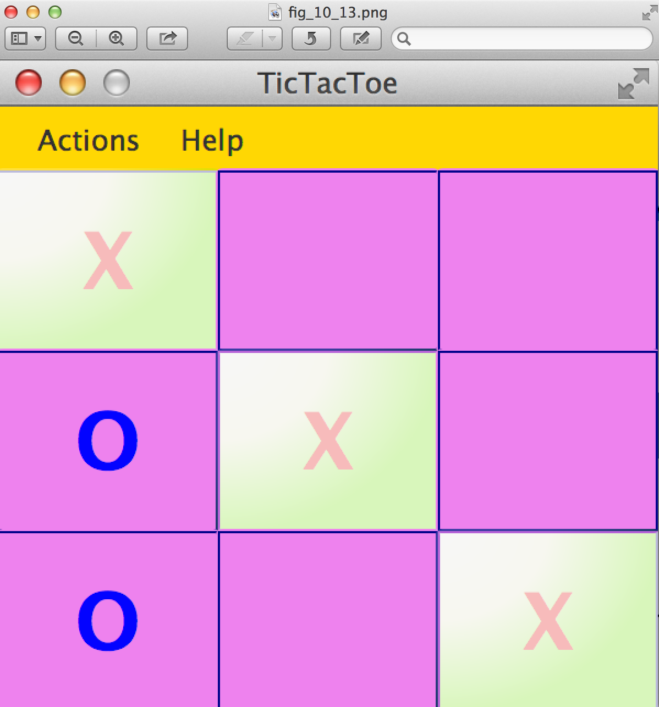

Compare this image with Figure 10-11, or better run the code that comes with the book to see the animation in action.

==== Handling the Tic-Tac-Toe Menu Play

The winner is found, but how to start a new game? Our gane has a menu Actions with the menu item Play. Now we need to make it working so the players can start a new game when either a winning combination is found or it's a draw.

The good news is that clicks on menu items are processes the same way as clicks on buttons. In the file _tictactoe.fxml_ we'll assign `onAction` event handler for the menu Play:

[source, html]
----
<MenuItem text="Play" onAction="#menuClickHandler"/>
----

When the user clicks on the menu Play, the controller needs to reset buttons' labels to blank and remove styling from the winning buttons. We'll do this by getting a hold of all children of our `GridPane` and invoking the method `forEach` passing a short lambda expression to it. This is what the method `menuClickHandler` will look like:

[source, java]
----
public void menuClickHandler(ActionEvent evt){

   MenuItem clickedMenu = (MenuItem) evt.getTarget();
   String menuLabel = clickedMenu.getText();
   
   if ("Play".equals(menuLabel)){           <1>
       ObservableList<Node> buttons =       <2>
              gameBoard.getChildren();
       
       buttons.forEach(btn -> {
         ((Button) btn).setText("");      <3>

         btn.getStyleClass().remove("winning-square"); <4>
       });

       isFirstPlayer = true;  <5>
   }
}
----

<1> This code processes just the clicks on the menu Play, but I included the if statement to check the menu label in case you decided to implement other menus too.

<2> We're getting references to all children of the grid (the buttons) in one shot. The method `getChildren` returns a JavaFX collection of type `ObservableList` located in the package `javafx.collections`.

<3> Each Java collection implements the method `forEach`, which gets a lambda expression to set the label of each button to an empty string.

<4> Then we're getting the reference to the styles of the button and remove the style `winning-square` if exists.  

<5> Finally, the code sets the variable `isFirstPlayer` to `true` so the next game will place an X as the first label.

Enjoy our Tic-Tac-Toe game!

=== Project: Playing Against Computer

Our version of the game is created for two players. In this assignment you'll need to change the program so the player can play against the computer. The player will keep playing with X's, and the computer with O's.

Write a method `goComputer` that should try to find if there are any two buttons with O's in each row, column or a diagonal. If found, the program should place a O to the winning position. If not found, the computer should place a O next to another O. If no O's are found, the computer should try to place an O in the middle of the board. If the middle square is occupied, place a O on the first blank button. 

The method `goComputer` should be called from the method `buttonClickHandler` right after the line that invokes the method `find3InARow`.

==== Challenge Yourself

Play an audio when the winning combination is found. To do this learn how to use the JavaFX class `AudioClip` located in the package `javafx.scene.media`. 