:toc-placement!:
:imagesdir: .

== Getting Comfy In IDEA IDE

Most programmers write, compile and run their applications in special programs that go by the name _Integrated Development Environment_  (IDE). Any IDE provides help as you type code, highlights the Java _keywords_,  has a _Help_ menu that describes all elements of the language, and makes it easier to find and fix errors in your programs. There are several excellent IDEs that are free to use. The most popular are http://www.eclipse.org/downloads/[Eclipse], https://netbeans.org/downloads/[NetBeans], and http://www.jetbrains.com/idea/download/[IntelliJ IDEA]. In this book we'll use IntelliJ IDEA Community Edition. This is an excellent IDE for developing Java applications, and if you decide to program later on in other programming languages, IDEA supports http://www.jetbrains.com/idea/webhelp/supported-languages.html[more than a dozen] other languages too.

In this chapter we'll start with downloading and installing IntelliJ IDEA IDE (let's just call it IDEA). Then we'll create a project called  `Hello`. You'll see that creating the Hello World application is a lot easier inside IDEA.

=== Installing IntelliJ IDEA

There are two version of IDEA IDE - Ultimate and Community. The Ultimate version is not free, but it has additional features useful for developing enterprise applications. But this book is about learning the basics of Java programming so using the free Community edition is all we will need.

Open the Web page http://www.jetbrains.com/idea/download/[IntelliJ IDEA] and click on the _Download Community_ button. It'll download the installer program with the name that starts with _ideaIC_ - just run it. On MAC OS the installer doesn't prompt any questions. Just drag the icon onto the Applications folder.

[[FIG2-0-0]]
.Installing IDEA on MAC OS
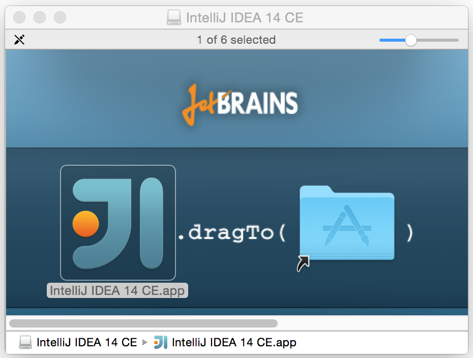

On Windows, you'll need to select the folder where IDEA will be install as shown below. Windows installer will also offer to create a desktop icon for IDEA - agree with this.

[[FIG2-0]]
.Selecting the destination folder on Windows
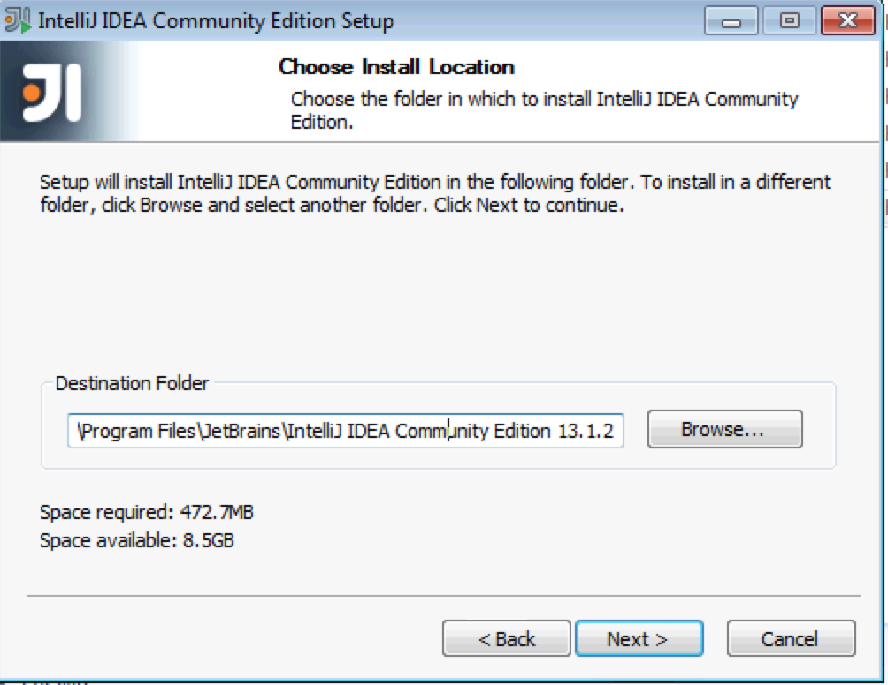

In several seconds you'll get the IDEA installed by clicking on the Next button. If you use MAC OS, find it using Spotlight on the top right corner of the screen and click on it. If you use Windows, click on the newly created IDEA icon on your desktop. The first question IDEA asks is if you want to import the settings from the older versions of IDEA. Do not select this. Next comes this Welcome screen:

[[FIG2-1]]
.Welcome to IntelliJ IDEA Community Edition
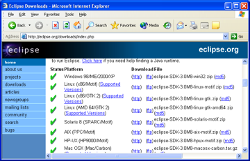

=== Creating Your First Project

In IDEA, your Java applications will be located in separate projects. As you've probably guessed, you'll need to select the option _Create New Project_ on the Welcome screen. Then IDEA will ask you about the type of the project you want to create.

[[FIG2-2]]
.Selecting the project type

Select the option to create a Java project. In IDEA projects consist of modules. By selecting Java we state that our project will have a Java module. Hit the button Next and then again on the following window that will ask about selecting a template that will be used in this project. Now we need to give our project a name and select the JDK to be used with this project.

[[FIG2-3]]
.Selecting the project name and JDK
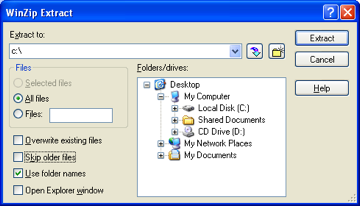

We don't want our project to be _untitled_, so replace this name with _hello_ in the top box. Note how the name of the folder in the Project location box changes accordingly. When you’ll try to do it on your computer, the project location will appear different than mine. Now you need to select the JDK. If you have never worked with Java before, the only JDK you will have is the one installed in Chapter 1 although Java programmers sometimes have more than one JDK installed. For example, they may not be allowed to use the latest JDK 8 for work projects, so they keep the JDK 7 around, but all the fun projects will be created with JDK 8.

We don't have such restrictions, so JDK 8 is our only choice. Now figure out where to locate it.

Click on the button New, select the menu item _JDK_, and you'll see a familiar screen for browsing the folders on your computer. Please refer to the first section of Chapter 1 ( _Installing Java on Your Computer_) depending on whether you are working with  MAC or Windows. I'm using MAC, so I'm choosing _Library_, _Java_, _JavaVirtualMachines_, _jdk1.8.0.jdk_. Notice the previous window now looks different.

[[FIG2-4]]
.The project name and JDK selected
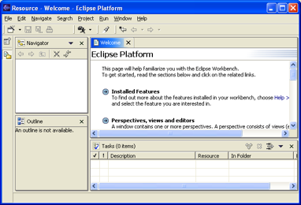

Press the button Finish and your new project is created. Every time you start IDEA it offers you little tips on how to use its cool features. You can opt out from this, but I recommend you read them - you might find some little gems that will make your work with IDEA more fun. The project _hello_ is ready, and you can start writing your Hello World program.

[[FIG2-5]]
.The project hello
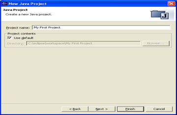

This project consists of the module hello and External Libraries. The source code of your program(s) will be located in the folder src in the hello module. The file _hello.iml_ is where IDEA remembers the settings of the project hello - you don't need to touch it. Under External Libraries you'll find a bunch of files that end in _.jar_. These JAR's are the libraries of code that came with JDK.

A simple project like our `HelloWorld` will have just one file with the source code _HelloWorld.java_. More advanced projects will consist of multiple files. To simplify the application deployment, all these files could be packaged in one or more JARs too. Both JRE and Java SDK include dozens of JARs. Java comes with a jar utility that is used to archive multiple Java classes and other files into a file having the name extension .jar. Internal formats of .jar and .zip files are the same. If your IDEA project will have multiple classes, you can package them into one JAR by using the menu File | Project Structure | Artifacts and then selecting the type JAR.

[[FIG2-5-1]]

=== Creating HelloWorld Class in IDEA

Java programs consist of _classes_, and you’ll start getting familiar classes' internals in the section "How Does Hello World Work". Let’s recreate the `HelloWorld` class from Chapter 1 in IDEA.  Select the folder _src_ in your project, and then select the menu File | New | Java Class.  You'll see a little popup window asking for a class name. Enter the name `HelloWorld` there.

[[FIG2-6]]
.Naming the class
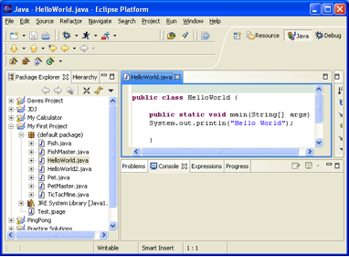

In a second IDEA will generate an empty class `HelloWorld` as shown below. The white area on the right is a very smart text editor that will allow you to not only enter the text of your program, but will also help you by suggesting what to type next as you type. This editor is really smart!

[[FIG2-7]]
.An empty class HelloWorld
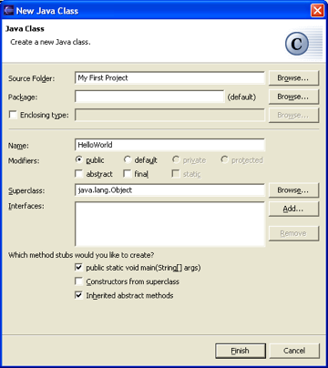

The text between `/\**` and `*/` is one of the ways to write comments in your programs. This is an area where you can type any text you want that describes your program in general or any particular code inside the class. We'll talk about various ways to write comments in the next chapter.

==== Adding the method main

It's time to key in the `main` method declaration inside the class like we did in Chapter 1:

`public static void main(String[] args)`

You can certainly type the above declaration, and IDEA will obediently start helping as you start typing. For example, I started typing the word `public`, and after entering the `pu` IDEA suggested the following selection of keywords that are appropriate in the current location inside the class.

[[FIG2-8]]
.Code Competion
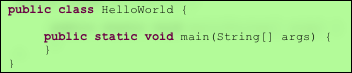

Pressing the button _Tab_ on the keyboard will turn `pu` into `public`. You can also press the keys _Control-Space_ to see suggested code completion at any time. But there is an even faster way to enter the declaration of the `main` method. Just type in the first letters of these keywords `psvm`, and press the _Tab_ key. IDEA will unfold these letters into the following:

[source, java]
----
public static void main(String[] args) {

}
----

Great job, IDEA! Such code completion minimizes typing and the number of typos you could make. At the end of this chapter in the section Additional Reading you'll find the link to a Web page showing more advanced features of code completion in IDEA. It may be a little early for you to understand everything that's explained there, but bookmark a link to this page for future reference.

TIP: To become a real pro in IDEA, you should use the _hotkeys_, which are combinations of key-presses on the keyboard. With hotkeys you'll be able to navigate in your IDEA projects a lot faster than by clicking through menus. Here's https://resources.jetbrains.com/assets/products/intellij-idea/IntelliJIDEA_ReferenceCard.pdf[the link] to the document listing IDEA's hotkeys.

Now we have the class `HelloWorld` with an empty _method_ `main`. The word _method_ means _action_. To run a Java class as a program, this class must have a method called `main`. Usually your applications will have many classes, but only one of them will have the method `main`. This class becomes the entry point in your application.

To complete our program, place the cursor after the curly brace in the line with `main`, push the button _Enter_ and type the following on the new line:

`System.out.println("Hello World!");`

After learning about the `psvm` shortcut you may be wondering, is there a way to do a similar trick with `System.out.println()`. Just type in `sout` and press the _Tab_ key. Voila! The `sout` magically turns into `System.out.println();`. Java programmers often use printing to the console so the creators of IDEA provided a shortcut for it.

To save the code changes and compile the class, just press _Ctrl-S_ on your keyboard. If you did not make any syntax errors, you won’t see any error messages therefore the program is compiled, but let’s introduce a syntax error on purpose to see what’s going to happen. Erase the last curly brace in the class `HelloWorld` and hit _Ctrl-S_ again. IDEA will add a squiggly line where Java compiler found the error, the line is marked with the red mark on the right, and if you'll hover the mouse pointer over this little red rectangle, you'll see the error message:

[[FIG2-9]]
.Compiler caught a syntax error
image::images/fig_2_09.png[]

As your project becomes larger, it’ll have several files and the compiler may catch more than one error. Can you see a list of errors from all classes? By default, IDEA doesn't compile all the classes from your project, but you can request compiling of the entire project every time you make a change or save the source code. Go to the IDEA menu Preferences (or Settings), select _Compiler_ and check off the option _Make project automatically_. Now select the menu View | Tool Windows | Problems to see all the problems in one list:

[[FIG2-10]]
.The Problems View
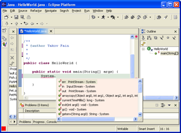

In our case we only have one compiler error. Java reached the end of the file while parsing (trying to understand your code), and something could not be found - the curly brace, of course. But what does this mysterious _(8,6)_ mean? The error was found in the line number 8 around the sixth character from the left. To see line numbers, right-click on the gray vertical bar to the left of the code editor and select the option Show Line Numbers. Now it's easier to map the error messages to the lines in the source code:

[[FIG2-11]]
.Displaying the line numbers
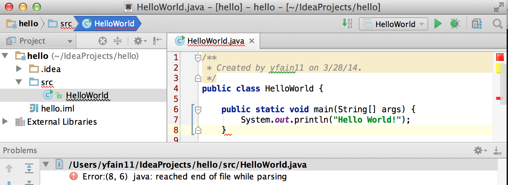

==== Running HelloWorld in IDEA

After all syntax errors are fixed, compiler automatically creates the HelloWorld.class when you save the code. IDEA doesn't show you _.class_ files, but if you are curious where they are, open the menu File | Project Structure to see the folder where the compiler's output goes. When a program is written, tested, does what it supposed to do (e.g. print Hello World), and if you want to give it to your friends you'll need to give  only compiled `.class` files. They don't need source code of your program, but they do need the JRE (not JDK) installed on their computer.

Java programmers can run their programs not only from a command window demonstrated in Chapter 1, but right from the IDE. Just right-click on the name HelloWorld in the Project view and select the menu item _Run HelloWorld.main()_. The program will run and you'll see the results in the Console View right inside IDEA:

[[FIG2-12]]
.Running HelloWorld in IDEA
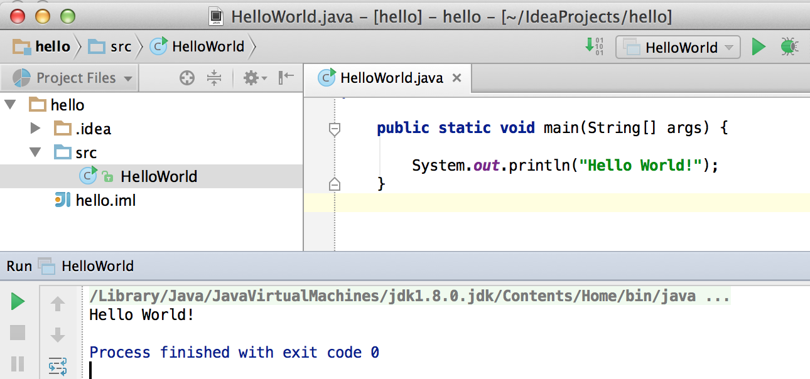

=== How Does `HelloWorld` Work?

It's great that you're following my instructions and the program works. But what exactly is happening in the program `HelloWorld`? What are all these keywords, braces and parentheses for?

Every Java program has at least one class, and Chapter 3 explains classes in detail. Classes can contain _methods_, which are the actions that the class can perform. The class `HelloWorld` has only one method `main`, which is a special action. It's a program starter or an entry point of any Java application. You can tell that `main` is not a Java keyword, but a method, because it has parentheses after the word `main`. Methods can _call_ (invoke) other methods, for example our method `main` calls the method `println` to display `Hello World!` on the screen.

Each method starts with a _declaration line_ a.k.a. a _method signature_:

`public static void main(String[] args)`

This method signature tells us the following:

* This method has `public` access level. The keyword `public` means that the method `main` could be accessed by any other Java class or the JRE itself.

* This method is `static`. The keyword `static` means that you don’t have to create an _instance_  of the `HelloWorld` object in memory to use this method. We’ll talk about classes and object instances in the next chapter.

* Does the method `main` _return_ any data? Say, if you'll write a method to add two numbers, it can return a result. The keyword `void` means that the method `main` doesn’t return any data to whomever calls it (JRE in this case).

* The method name `main` goes right before parentheses.

* Some methods have parameters (a.k.a. arguments), which go inside the parentheses. It's the data that could be given to the method from another place of the program that invokes this method. The method `main` has parameters - and an array of text values `String[] args`. You'll learn how to use the parameters of the method `main` in Chapter 9 in the section Command Line Arguments.

A Java program can consist of several classes, and each class may include methods. Usually, a Java class has several methods. For example, a class `Game` can have the methods `startGame`, `stopGame`, `readScore`, and so on. But only one class in the application will have the method `main`.

The body of our method `main` has only only one _statement_:

`System.out.println("Hello World!");`

Every statement or a method call must end with a semicolon. The method `println` knows how to print data on the _system console_ (command window). Java method names are always followed by parentheses. If you see a method with empty parentheses, this means that  this method does not have any arguments and doesn't expect to receive any data. The above method `println` has one argument - a `String` with the value `Hello World!`.

`System.out` means that the variable `out` is defined inside the class `System` that comes with Java. How are you supposed to know that there’s something called `out` in the class `System`? IDEA will help you with this. After you type the word `System` and a dot, IDEA will show you everything that is available in this class. You can also put a cursor after the dot and press _Ctrl-Space_ at any time to bring up a help box similar to this one:

[[FIG2-15]]
.Peeking inside the System class with code completion
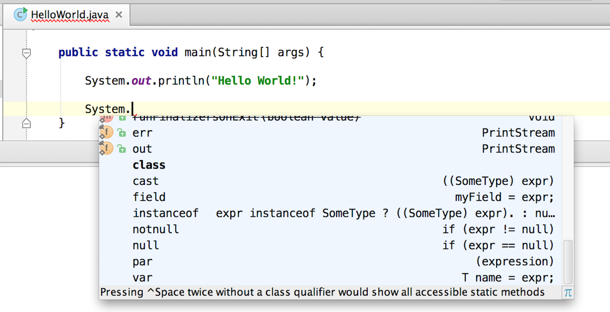

This tells me that the Java class `System` has a variable `out` of type `PrintStream`. Are you curious as to what `PrintStream` is? Click on `out` in your code and select the menu _View | Quick Documentation_ to read the dry documentation. The fact that a period goes after `out` followed by a method name - `out.println()` - tells us that `out` represents an object, which apparently has a method called `println()`.

We call it a _dot notation_. We write _class_name.method_name_ or _variable_name.method_name_. Say you have a class `PingPongGame` that has a method `saveScore`.  If the method `saveScore` was declared with the two arguments `player` and `score`, you may _call_ this method for Dave who won three games:

`PingPongGame.saveScore("Dave", 3);`

In this example, the arguments may be given to the method for some kind of processing like saving the score on the disk. Since the name Dave was placed in parentheses, we can guess that the first argument has a `String` type, which is used for text. The second argument is clearly of a numeric type but we can tell what's the exact type only after reading the declaration of the method `saveScore` inside the source code of the class `PingPongGame`.

In the next chapter we'll spend a lot more time seeing what Java classes consist of.
