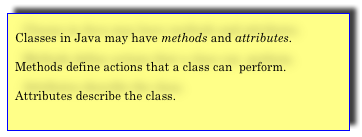
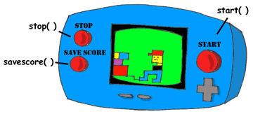
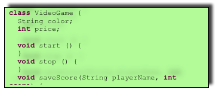
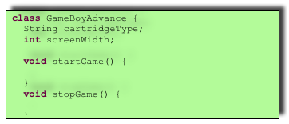
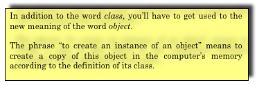
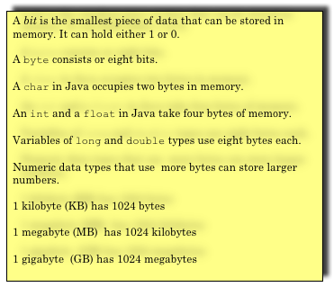
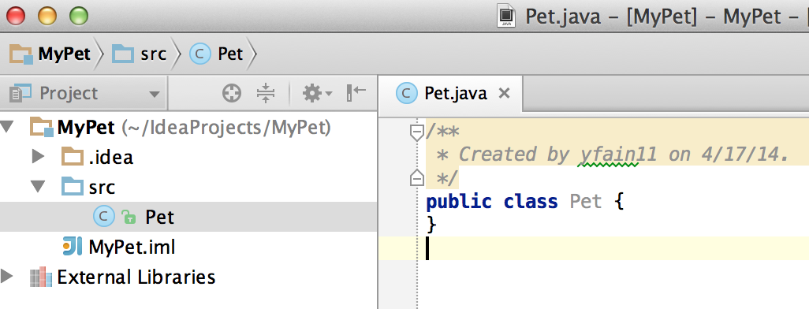

:toc:
:toclevels: 4
:imagesdir: ./

== Chapter 3. Meet Classes - the Main Language Constructs

In the real world you see and use various objects, and each of them is of some kind like toys, food, animals, electronics et al. In Java instead of saying a kind of objects, we say a class of objects. A class is like a blueprint of an object. In this chapter you’ll get familiar with classes - the main constructs of the Java language. 

Any program that you’ll write will have at least one class. You’ll learn how to declare a class and how to create one or more object based on the class declaration. You’ll also learn about a class internals – what a class can consist of. Finally, I’ll show you how to create a class that inherits features of another class.

Java defines a number of data types. Some of them are simple, like `int`, which represents integer numbers. Some of them are more complex - they are called _classes_, like `System`, which can be used for things like printing texts on the screen, exiting a program or cleaning computer's memory. 

When you installed Java on your computer, you installed thousands of Java classes. Your Java programs will also consist of _classes_ that can represent _objects_ from the real world. If a class is a data type, an object is a representative of a specific type. For instance, you can see ten dogs on the street, and they all represent the  class `Dog`. 

Programmers start working on any application with deciding  which Java classes to include in the program and how many objects of each type to create. Say, they can define a class `Player` in the gaming application and create two object instances of this type. 

=== Dissecting Classes and Objects

While programmers talk to each other, they may say "Do something with the class Player" or "Do something with the object Player". We need to learn the difference between the meaning of the words _class_ and _object_.

==== Classes

Let's see what Java classes can consist of. Actually a very simple class can have nothing inside. Take a look at this class declaration:

[source, java]
----
class VideoGame {
  
}
----

This class is empty - it knows nothing and can't do anything, because there is no code between the curly braces. From the Java syntax perspective this class is legit, and compiler won't complain - there is a valid keyword `class` followed by its name `VideoGame`, and the opening curly brace has the matching closing one. But we need classes that can do stuff. We can place methods and attributes inside the class.

* Methods define actions that a class can perform.
* Attributes describe various properties of a class.

Let’s fill the class `VideoGame` with some content. This class may have several methods, which can tell _what an object of this class can do_: start the game, stop it, save the score, ask for additional lives on Facebook, and so on. This class also may have some attributes (a.k.a. fields): color, price and others. An object that represents the class `VideoGame` can look like this:

[source, java]
----
class VideoGame {
  
  String color;
  int price;
    
  void start () {
     // The code to start the game goes here
  }
  
  void stop () {
     // The code to stop the game goes here
  }
  
  void saveScore(String playerName, int score) {
     // The code to save score goes here
  }
}
---- 

This class has two attributes `color` and `price`. The color attribute has the `String` data type, which is used for storing any text. The `price` is of a type `int` for storing integer numbers. The class `VideoGame` has three _methods_: `start`, `stop`, and `saveScore`. These are the actions that our video game should perform. At this point each of these methods has just a single line that starts with two slashes //. 

NOTE: If a line starts with two slashes, it contains a _single line comment_ - just the description of a code fragment. If you need to write several lines of comments, just type in a slash followed by the asterisk `/*`, then key in as many lines of a text as you want followed by `*/`. 

Our class `VideoGame` can be used as a starting building block for pretty much any video game – all game consoles have the color attribute, all of them allow to save score, and all of them have price tags.  

[[FIG3-1]]
.The Video Game Object

 
We can be more specific and create another Java class called `PlayStation4`. It also belongs to the family of video games, but has some properties that are specific to the model Play Station 4, for example sharing on Facebook and Twitter. So among other things, the class `PlayStation4` will have methods `shareOnFacebook` and `shareOnTwitter`.

[source, java]
----
class PlayStation4{
     
    int hardDiskSize;

  // Some other attributes and methods go here

  void shareOnFacebook(){
     // Code to share on Facebook go here
  }

  void shareOnTwitter(){
     // Code to share on Twitter go here
  }

}
----

==== Objects

We'll often use the phrase _create an instance of an object_, which means to create an object in computer's memory based on some class declaration. If a game factory will produce ten thousand of such games, a programmer can say that they created ten thousand instances of the class `PlayStation4`. 

The factory description of `PlayStation4` relates to an actual game the same way as a Java class relates to its instance in memory. The process of building actual games based on this description in the game factory is similar to the process of creating instances of  `PlayStation4` objects in Java. For example, the next code sample creates one instance of the class `PlayStation4` and calls its method `shareOnFacebook`.

[source, java]
----
public class CreatePlayStation4Objects {

  public static void main(String[] args) {

    // create one instance of PlayStation4 class
    PlayStation4 firstPlayStation = new PlayStation4();

    // call the method shareOnFacebook
    firstPlayStation.shareOnFacebook();
  }
}
----

In many cases, a program can use a Java class only after creating the instance of an object. The same with manufacturers - they create thousands of game copies based on the same description. Even though these copies represent the same class, they may have different _values_ in their attributes - some of them are black, while others can be silver. Some of them have 500GB hard disk dive, while some are upgraded to 1TB. 

[[FIG3-2]]
.One Class, Three Instances

In programmer's jargon, you can create multiple instances of the `PlayStation4` objects with different values in the `hardDiskSize` attribute.  

=== Java Data Types and Variables

In Java values are stored in _variables_. For example, the class attribute that has a value of the disk size can be stored in the variable `hardDiskSize` of type `int`:

`int hardDiskSize;`

The method parameters (a.k.a. arguments) are also stored in variables. The method saveStore has two arguments: `playerName` of type `String` and `score` of type `int`:

`void saveScore(String playerName, int score)`

==== Primitives

Simple Java data types are called _primitives_ they are written in small letters (e.g. `int`, `long`, `char`, `boolean`). So the `score` is of a primitive data type, while the `playerName` is not.  In Java you have to declare the type and the name of a variable first, and then use it. 

Remember algebra equations like `y=x+2`?  In Java you’d need to start with declaring the variables `x` and `y` of some numeric data type like `int`, `float` or `double`:

`int x;`
`int y;`

Now you can use the variables. The next two lines show how you can assign them values. If your program assigns the value of five to the variable `x`, after evaluating `x+2` the variable `y` will be equal to seven:

`x=5;`
`y=x+2;`

In Java you are also allowed to change the value of a variable in a somewhat unusual way. The following two lines change the value of the variable `y` from five to six:

`int y=5;`
`y++;`

Despite the two plus signs, JVM is still going to increment the value of the variable `y` by one. The `y++` means, read the value of the variable `y`, increment it by one, and assign it back to `y`. The longer way to achieve the same result would be `y=y+1`. After the next code fragment the value of the variable `myScore` is also equal to six:

`int myScore=5;`
`myScore=myScore+1;`

You can also use multiplication, division and subtraction the same way. Look at the following piece of code:

[source, java]
----
int myScore=10;

myScore--;
myScore=myScore*2;
myScore=myScore/3;

System.out.println("My score is " + myScore);
----

What do you think this code prints? IntelliJ IDEA has a useful tool called Groovy Console (it's under the Tools menu). It allows you to test any code snippet (like the one above) without even creating a class or methods. If you'll copy the above code fragment into Groovy Console and hit the green button play, you see that the value of the variable `myScore` is 6. 

[[FIG3-3]]
.Running the code fragment in Groovy Console

[source, java]

To see the result of the score calculations, just  click on the console tab at the bottom of the screen:

`My score is 6`

In this example the argument of the method `println()` was constructed from two pieces – the text “My score is ” and the value of the variable `myScore`. Creation of a `String` from pieces is called _concatenation_.  Even though `myScore` is a number, Java is smart enough to convert this variable into a `String`, and then attach it to the text "My Score is ".

Look at some other ways of changing the values of the variables:

[source, java]
----
myScore=myScore*2; // it's the same as `myScore*=2;
myScore=myScore+2; // it's the same as `myScore+=2;
myScore=myScore-2; // it's the same as `myScore-=2;
myScore=myScore/2; // it's the same as `myScore/=2;
----

There are eight primitive data types in Java, and you have to decide which ones to use depending on the type and size of data you are planning to store in your variables. These are Java primitives:

* Four data types for storing integer values – `byte`, `short`, `int`, and `long`.

* Two data types for values with a decimal point – `float` and `double`.

* One data type for storing a single character values – `char`.

* One _logical_ data type `boolean` that allows only two  values:  `true` or `false`.

You can assign an initial value to a variable during its declaration, and this is called _variable initialization_, for example:

[source, java]
----
char grade = 'A';
int chairs = 12;                           
boolean playSound = false;         
double nationalIncome = 23863494965745.78;
float gamePrice = 12.50f;      
long totalCars =4637283648392l; 
----

In the last two lines the values have letters at the end. The `f` is for `float` and `l` means long.

If you declare, but won’t initialize primitive variables, Java will do it for you by assigning zero to each numeric variable, `false` to `boolean` variables, and a special code ‘\u0000’ to variables of type `char`.

==== Classes as Data Types

Not all variable have primitive data types. For each primitive data type has a corresponding _wrapper_ class, for example `Integer`, `Double`, `Boolean`, etc. These classes also can store the values of the corresponding primitive type, but also have useful methods to convert data from one type to another. 

In some cases there is no primitive type that suit your needs. For example, there is no primitive type for storing long texts. While the `char` data type is used to store only one character, Java also has a class `String` for working with a longer text, for example: 

`String lastName="Smith";`

If you declare your own class, consider it a new data type, and you can start declaring variables of this type, for example, you can declare the variable named `myFirstGame`  of type `VideoGame`:

`VideoGame myFirstGame`

Java programmers have agreed to name variables starting  with small letters. To make the variable name more meaningful, it can consist of several words, and each word starts with the capital letter as in `myFirstGame`. You're also allowed to start variable names with the dollar sign like `$myMoney` or underscore: `_myBestFriend`.   Variable names cannot contain spaces. 

Java also has a special keyword `final`, and if it’s used in a declaration of a variable, it means that you can assign a value to this variable only once, and this value cannot be changed afterwards. In Java we usually name final variables using capital letters:

`final String STATE_CAPITAL="Washington";`

==== How Much Memory is Needed 

Variables are stored in computer's memory, and occupy more or less space depending on the data type. We measure memory in bits, bytes, kilobytes (1024 bytes), megabytes (1024 kilobytes or Kb), gigabytes (1024 Mb) and so on.  A bit is the smallest piece of data that can be stored in memory. It can hold either 1 or 0. A byte consists or eight bits.

A `char` variable occupies two bytes in memory.

An `int` and a `float` take four bytes of memory each.

Variables of `long` and `double` types use eight bytes each.

Only one bit is required to store the value of `boolean` variable.

Numeric data types that take more bytes can store larger numbers.

=== Creation of a Pet

Let’s design and create a class `Pet`. First we need to decide what actions our pet will be able to do. How about eat, sleep, and say? We’ll program these actions in the methods of the class `Pet`. We’ll also give our pet the following  attributes: age, height, weight, and color.

It's time for hands-on work. Start IDEA IDE and create a new project as explained in Chapter 2. But this time name it MyPet instead of Hello. Click on the _src_ folder in IDEA and create a Java class called `Pet` using the menu File | New | Java Class.

Your screen should look similar to this one:

[[FIG3-4]]
.MyPet Project 

Now we are ready to declare attributes and methods in the class `Pet`.  Java classes and methods enclose their bodies in curly braces. 

To declare variables for class attributes we should pick data types for them. I suggest an `int` type for the age, `float` for  weight and height, and `String` for the pet’s color.

[source, java]
----
public class Pet {

    int age;
    float weight;
    float height;
    String color;
}
----

The next step is to add some methods to this class. Before declaring a method you should decide if it should take any arguments and should return a value. This is what I suggest:

* The method `sleep()` will just print a message _Good night, see you tomorrow_ – it does not need any arguments and will not return any value. 

* The same is true for the method `eat()`.It will print the message _I’m so hungry, let me have a snack like nachos!_.  

* The method `talk()` will not be printing any messages, but will the prepare a message based on the word or a phrase passed to this method as an argument. This method will build a phrase using the argument and will return it back to the calling program. 

The new version of the class `Pet` will look like this:

[source, java]
----
public class Pet {

    int age;
    float weight;
    float height;
    String color;

    public void sleep(){
        System.out.println(
                "Good night, see you tomorrow!");
    }

    public void eat(){
        System.out.println(
         "I’m so hungry, let me have a snack like nachos!");
    }

    public String talk(String aWord){
        String petResponse = "OK!! OK!! " +aWord;
        return petResponse;
    }
}
----

This class represents these friendly little monsters from the "real world":

[[FIG3-5]]
.Little Monster

Let’s talk now about the signatures of each methods in detail starting with the method `sleep`:

`public void sleep()`

This method signature tells us that `sleep()` can be called from any other Java class ( because it's `public`). This method does not return any data (the keyword `void`).  The empty parentheses mean that this method does not take any arguments - it does not need any data from the outside world to print the same text. 

The signature of the method `eat()` is similar to `sleep()`. 

The signature of the method `talk()` looks like this:

`public String talk(String aWord)`

This method can also be called from any other Java class, but has to return some text, which is prescribed by the keyword `String` in front of the method name. Besides, it expects some text data from outside, hence the argument `String aWord`.

[[FIG3-6]]
.Little Monster eats

How do you decide if a method should or should not return a value? If a method performs some data manipulations and has to give the result of these  manipulations back to the  calling class, it has to return a value.  You may say, that the class `Pet` does not have any calling class! That’s correct, so let’s create one called `PetMaster`. We'll create it in the same IDEA project MyPet. 

This class will need a method `main()` to become a runnable program (the class `Pet` didn't have one). Remember from Chapter 2, typing _psvm_ followed by the Tab key will quickly create the method `main()`. We'll place the code communicating with the class `Pet` inside the method `main()`.

NOTE: Do not forget to press _Ctrl-S_ (_CMD-S_ on Mac) to save and compile this class! 

[source, java]
----
public class PetMaster {

    public static void main(String[] args) {

        String petReaction;      <1>

        Pet myPet = new Pet();   <2> 

        myPet.eat();             <3> 

        petReaction = myPet.talk("Tweet!! Tweet!!"); <4>

        System.out.println(petReaction);  <5>

        myPet.sleep();        <6>
    }
}
----

<1> The variable `petReaction` will store the value returned by the method `say`.  

<2> This is how to create an instance of the object `Pet` using the Java operator `new`. This line declares a variable of type `Pet`  - that’s right, you can treat any classes created by you as new Java data types.

<3> Calling the method `eat()` on the object `Pet`. After the instance of `Pet` was created, the variable `myPet` knows its address in memory. So you can call the method `eat()` (as well as any other) on this particular instance of `Pet`. 

<4> If a method returns a value,  specify a variable that will store returned value to the left of the equal sign. In out code it's `petReaction` of type `String`.  Such variable should have the same type as the return value of the method. 

<5> The value of the variable `petReaction` is passed as an argument to the method `prinln` for output.

<6> Calling the method `sleep()` on the object `Pet`.

To run the class `PetMaster` right-click on its name in the Project view in IDEA, and select the option _Run PetMaster.main()_. This program will output the following:

_I’m so hungry,let me have a snack like nachos!
OK!! OK!! Tweet!! Tweet!!
Good night, see you tomorrow!_

[[FIG3-7]]
.Tweet, Tweet!
image::images/fig_3_07.png[width=400, height=550]
  
At this point the project MyPet consists of two Java classes: `Pet` and `PetMaster`. The role of the class `Pet` is to represent attributes and behavior of a pet, while the class `PetMaster` starts the program, _instantiates_ the class `Pet` and calls its methods.  Your typical projects will consist of multiple Java classes, but only one of them will have have the `main()` method, which is the entry point of the application.  

=== Inheritance – a Fish Can Be a Pet Too

The class `Pet` will help us learn yet another important feature of Java called _inheritance_. In the real life, every person inherits some features from his or her parents. Similarly, in the Java world you can also create a new class, based on the existing one. 

The class `Pet` can include behavior and attributes that are shared by many pets – all of them eat and sleep, some of them make sounds, their skins have different colors, and so on. On the other hand, not all pets are the same. Dogs bark, fish swim and don't make sounds, parakeets  speak better than dogs. But all of them eat and sleep. That’s why it’s easier to create a class `Fish` that will _inherit_ some common behavior and attributes from the class `Pet`, rather than creating `Dog`, `Parrot` or `Fish` from scratch every time. 

Java has a special keyword `extends` that will do the trick. Create in IDEA a new class Fish and then add to its declaration `extends Pet` so it'll look as follows: 

[source, java]
----
class Fish extends Pet{

}
----

This class `Fish` is a _subclass_ of the class `Pet`. AAccordingly, the class `Pet` is a _superclass_ of the class `Fish`. In other words, you use the class `Pet` as a template for creating a class `Fish`.

Even if you will leave the class `Fish` empty as it is now, you can still use every method and attribute inherited from  the class `Pet`. Take a look, we're creating an instance of the object `Fish` and are calling its method `sleep()`:

[source, java]
----
Fish myLittleFish = new Fish();
myLittleFish.sleep();
----

Even though we have not declared any methods in the class `Fish` yet, we call the method `sleep()`, which was declared in its superclass `Pet`! In Java all classes are automatically inherited from the class `Object`. Even though we've declared the class `Pet` without using the keyword `extends` it still extends the class `Object`. With the keyword `extends` you can build class hierarchies. For example, many animal classes can extend the class `Pet`. 

[[FIG3-8]]
.Class Hierarchy

Let’s not forget, however, that we’ve  created the class `Fish` as a subclass of `Pet`, because we wanted to add some additional features that only fish have and reuse some of  the code that we wrote for a _general pet_.For instance, not all pets can dive, but fish certainly can. Let’s add a new method `dive()` to the class `Fish`. 

[source, java]
----
public class Fish extends Pet {

   int currentDepth=0;

   public int dive(int howDeep){
    
    currentDepth=currentDepth + howDeep;
    System.out.println("Diving for " + 
                     howDeep + " feet");
    System.out.println("I'm at " + currentDepth +
                       " feet below sea level");
  
    return currentDepth; 
  }
}
----

The method `dive()` has an _argument_ `howDeep` that tells the fish how deep it should go. We’ve also declared a class variable `currentDepth` that will store and update the current depth every time you call the method `dive()`. This method returns the current value of the variable `currenDepth` to the calling class. The plus signs in the `pintln()` lines are not about addition - we're building strings of characters by concatenating their pieces. 

Using IDEA create another class `FishMaster` that will look like this:

[source, java]
----
public class FishMaster {

  public static void main(String[] args) {
    
    Fish myFish = new Fish();
    
    myFish.dive(2);
    myFish.dive(3);
    
    myFish.sleep();
  }
}
----

The method `main()` instantiates the object `Fish` and calls its method `dive()` twice with different arguments - two and three. After that, it calls the method `sleep()`. When you run the program `FishMaster`, it will print the following messages:

_Diving for 2 feet_
_I'm at 2 feet below sea level_
_Diving for 3 feet_
_I'm at 5 feet below sea level_
_Good night, see you tomorrow_

Have you noticed that beside the methods defined in the class `Fish`, the `FishMaster` also calls method `sleep()`  from its superclass `Pet`? This is what inheritance is all about – you do not have to copy and paste code from the class `Pet` – just use the keyword `extends`, and the class `Fish` can use `Pet`’s methods! 

[[FIG3-9]]
.What's the current depth?

One more thing, even though the method `dive()` returns the value of  `currentDepth`, our `FishMaster` does not use it. That’s fine, -  our `FishMaster` does not need this value, but there may be some other classes that will also use the class `Fish`, and they may find knowing the current depth  useful. For example, think of a class `FishTrafficDispatcher` that has to know positions of other fish under the sea before giving permissions to dive to avoid traffic accidents.

=== Method Overriding

As you know, fish do not speak (at least they do not do it aloud). But our class `Fish` has been inherited from the class `Pet` that has the method `talk()`. This means that nothing stops you from writing `myFish.talk();`.

Do you really want our fish to talk? If you do not want this to happen, the class `Fish` has to _override_ the `Pet`’s typical behavior - the method `talk()`. If you declare  a method with exactly the same signature in a subclass as in its superclass, the subclass' method will be used instead of  the method of the superclass. Let’s add the following method `talk()` to the class `Fish`.

[source, java]
----
public String talk(String something){
  return "Don't you know that fish do not talk?";
} 
----

Now add the following three lines to the method `main()` of the class `FishMaster`:

`String fishReaction;`
`fishReaction = myFish.talk("Hello");`
`System.out.println(fishReaction);`

Run the program and it’ll print 

`Don't you know that fish do not talk?`

This proves that `Pet`’s method `talk()` has been _overridden_, or in other words, suppressed.

Wow!  We’ve learned a lot in this chapter – let’s just take a break.
 

=== Challenge Yourself

1. We've  used the variable of type `int` to to store the price in the class `VideoGame`. Is there a more suitable primitive data type for storing prices?

2. Create a new project in IDEA named chapter3 and a new Java class `Car` with the following methods:
+
`public void start()`
+
`public void stop()`
+
`public int drive(int howlong)`
+
The method `drive()` has one argument - the driving time. The method has to return the total distance driven by the car for the specified time. Use the following formula to calculate the distance: `distance = howlong*60;`. Use the statement `return distance` as the last line in the method `drive()`. 

3. Run this program by using the menu Run in IDEA.

4. Write another class `CarOwner` with the method `main()` that creates an instance of the object `Car`and call its methods.  The result of each method call has to be printed using `System.out.println()`.

5. Create a subclass of `Car` named `JamesBondCar` and override the method `drive()` there. Now use the following formula to calculate the distance: `distance = howlong*180;`
+
Be creative, print some funny messages from the method `drive()`!

6. Create an instance of the class `JamesBondCar` in the `main()` method of `CarOwner`. Re-run the program `CarOwner` to see that it calls the overridden method `drive()`.
