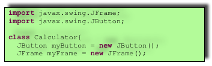
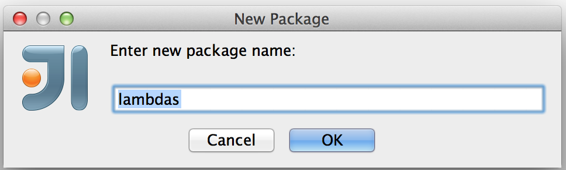

:toc-placement!:
:imagesdir: .

== Interfaces, Lambdas, Abstract and Anonymous Classes

In this chapter I'll focus on discussing how you can program _behavior_ in Java.  Classes have attributes (e.g. color, number of doors) and exhibit behavior (e.g. eat, sleep, or dive). There is a special group of programming languages that are called _functional_ (e.g. JavaScript, Scala et al.) In these languages you can simply write functions like `eat`, `sleep`, or `dive`, and these functions can live their independent lives and don't have to be declared in classes. In _object-oriented_ languages behavior is implemented in methods defined in classes. Starting from Java 8 you can also program behavior in so called _lambda expressions_ covered later in this chapter. 

So far I was declaring and implementing behavior in methods located inside Java classes. But there is a way and a reason to separate the method declaration from its implementation. Such separation can be done using _interfaces_.

=== Java Interfaces

While you can just create a Java class and implements all its methods there, a more formal way of declaring the behavior of the class in a separate `interface`. Then a class declaration would include the keyword `implements` followed by the name of the interface. This is a way to declare an application program interface (API) - what the class can do - so the programmer can quickly look at the short declaration of the interface rather than going through a longer code of the class.   

For years, Java _interfaces_ were used mainly for holding method declarations and `final` `static` variables. For example, the interface `Talkable` contains the declaration of just one method `talk`:

[source, java]
----
interface Talkable{
	public void talk();
}
----

Since the method `talk` is not implemented here, it's called _abstract_. 

NOTE: To create a new interface in IDEA, select the menu File | New | Java class and select Interface in the Kind box.

[[FIG5-1]]
.Creating an interface in IDEA

You should be thinking, "What's the point of simply declaring a method without implementing it?" The thing is that more than one class can exhibit the same behavior. For example, a dog, a cat, and a parrot can "talk". But they "implement it" differently. A parrot can repeat words, while dogs bark. Cats talk by meowing. Accordingly you can declare three classes that will _implement_ `Talkative` interface differently, as shown below:

[source, java]
----
public class Parrot implements Talkative {
    public void talk(){
        System.out.println("My name is Kesha.");
    }
}

public class Dog implements Talkative {
    public void talk(){
        System.out.println("Bark! Bark-bark!");
    }
}

public class Cat implements Talkative {
    public void talk(){
        System.out.println("Meow! Meow!");
    }
}
----

These three classes use the Java keyword `implements`, which means they promise to implement all abstract methods in the interface(s) listed after the keyword `implements` otherwise the Java compiler will complain: "You promised to implement all abstract methods from `Talkable`, where are they? Keep the promise!" 

What if we need to create the class `Fish` that uses interfaces? Fish don't talk. But they swim. Dogs can talk and swim, right?  Why won't we declare yet another interface `Swimmable` with the methods `swim` and `dive`?

[source, java]
----
public interface Swimmable {

    public void swim(int howFar);

    public void dive(int howDeep);
}
----

Now let's leave the parrots alone. Let's create a new class `Fish` and change the class `Dog` just a little bit. The `Fish` will implement `Swimmable` and the `Dog` will implement two interfaces:

[source, java]
----
public class Fish implements Swimmable {
    public void swim(int howFar){
        System.out.println("OK, will swim " + howFar + " feet");
    }
    public void dive(int howDeep){
        System.out.println("OK, will dive " + howDeep + " feet");
    }
}

public class Dog implements Talkative, Swimmable {
    public void talk(){
        System.out.println("Bark! Bark-bark!");
    }

    public void swim(int howFar){
        System.out.println("Will swim about a half of this distance: " + howFar/2 + " feet");
    }

    public void dive(int howDeep){
        System.out.println("C'mon, don't ask a dog to dive, please!");
    }
}
----

When a class implements several interfaces, make sure to implement each and every abstract method declared in these interfaces. I'll tell you more: a class can extend another class and implement interfaces at the same time, for example:

[source, java]
----
class Fish extends Pet implements Swimmable{
  
  // your code implementing swim(), dive() 
  // and any other methods goes here
}
----

NOTE: Java includes several interfaces that don't declare any methods (e.g. `Serializable`). They are called _marker interfaces_. You don't need to implement any methods in classes that implement marker interfaces. They are used by the Java compiler internally to generate the byte code in a special way.

==== Default Methods in Interfaces

To tell you the truth, I don't like the fact that I had to implement the method `dive` in the class `Dog`. The dogs I've seen can't dive. Can the interface `Swimmable` be changed so I'm not forced to write the implementation of the method `dive` in the class `Dog`? Yes, it can. Java 8 introduced a new keyword `default`. Now you're allowed to write a default implementation of a method in the interface. Such a method won't be considered abstract anymore, and you won't be forced to implement it in your class. Let's add a default implementation of the method `dive` to `Swimmable`.

[source, java]
----
public interface Swimmable {

    public void swim(int howFar);

    public default void dive(int howDeep){
        System.out.println("Can't dive, sorry");
    };
}    
----

Now the class `Dog` doesn't have to implement the method `dive` - the compiler will see a default implementation and won't complain. The next version of the class `Dog` implements only the method `swim` from `Swimmable`.

[source, java]
----
public class Dog implements Talkative, Swimmable {
    public void talk(){
        System.out.println("Bark! Bark-bark!");
    }

    public void swim(int howFar){
        System.out.println("Will swim about a half of this distance: " + howFar/2 + " feet");
    }
}
----

There is no need to change the class `Fish`. It also implements `Swimmable`, but has its own version of the method `dive`, which will override the default implementation of the `dive` from `Swimmable`. You can still call the method `dive` on the instance of the `Dog` class - the default implementation will be invoked. The next class `PetMaster` will demonstrate this.

[source, java]
----
public class PetMaster {
    public static void main(String[] args) {

        Dog myDog = new Dog();
        myDog.talk();
        myDog.swim(7);
        myDog.dive(2);  // will use default method

        Fish myFish = new Fish();
        myFish.swim(50);
        myFish.dive(20);
    }
}
----
Run this program and you'll see the following output on the console:

[source, java]
----
_Bark! Bark-bark!
Will swim about a half of this distance: 3 feet
Can't dive, sorry
OK, will swim 50 feet
OK, will dive 20 feet
----

The message "Can't dive, sorry" was printed by the default method `dive` from the interface `Swimmable`.

[[FIG5-1-1]]
.Dogs can't dive

==== Static Methods in Interfaces

Starting from Java 8, interfaces are also allowed to include static methods, which are not specific to any instance and can be used only internally by other methods of the interface. The following example illustrates the use of a static method in the interface. Now the default implementation of the method `dive` won't just reject an offer to swim, but will check the current month: if it's June, July, or August then diving is allowed because the water should be warm. 

The modified version of the `Swimmable` interface includes a static method `isSummer` that checks the current month and returns `true` if it's June, July, or August. I'm using the Java Date and Time API here. The default method `dive` calls the static method `isSummer` and either agrees or disagrees to dive depending on the time of the year.

[source, java]
----
import java.time.LocalDate;
import java.time.Month;

public interface Swimmable {

    public void swim(int howFar);

    public default void dive(int howDeep){

        if (isSummer()){
            System.out.println("OK, will dive. The water should be warm.");
        } else {
            System.out.println("Can't dive, sorry. The water's cold for diving.");
        }
    };

    // Check if it's summer now
     static boolean isSummer(){
        Month month = LocalDate.now().getMonth();
        if (month == Month.JUNE || month == Month.JULY || month == Month.AUGUST){
            return true;
        } else{
            return false;
        }
    }
}
----

The method `isSummer` uses the class `LocalTime` to get `Month`, which has a data type `enum` that I haven't used so far. It's a special data type to represent a fixed number of some values, like months in this case. There are only 12 months, and Java Date and Time API listed them by name in the `enum` called `Month`. The only values that are allowed here are `Month.JANUARY` to `Month.DECEMBER`. Using enums makes the programs more readable - it's easier to deal with months by names than by numbers.

.Packages and import statements
*******************************
Java comes with many useful classes that are organized in packages. Some packages include classes responsible for drawing, while other packages have classes to work with the Internet, and so on. For example the class `LocalDate` is located in the package called `java.time`, and the full name of the class `LocalDate` is `java.time.LocalDate`.  

To let the compiler know where the class `LocalDate` is located you could specify the full class name, for example:

[source, java]
----
java.time.LocalDate todaysDate = java.time.LocalDate.now();
----

But this syntax is difficult to read so we use the `import` statements above the class declaration to let the compiler know the location of the class, interface, or enumeration. For example:

[source, java]
----
import java.time.LocalDate;
----

Now you can use just the class name without the need to specify the package name:

[source, java]
----
LocalDate todaysDate = LocalDate.now();
---- 

The packages are stored in directories and subdirectories on the disk. If you see a full class name `java.time.LocalDate` it means that this class was originally created in the subdirectory _time_ of the directory _java_. 

From now on we'll use packages and import statement in every chapter of this book. If you want to place your class into a package, just create a subdirectory (e.g. _pets_) and add a `package` statement on the top of your class definition, for example:

[source, java]
----
package pets;

class Dog{
	// your code goes here
}
---- 

One last thing: Lazy kids use the wild cards in import statements. Instead of writing one import statement per class, they would use an asterisk:

[source, java]
----
import java.time.*;
----

This means that definitions needed for my program are located in the package `java.time`. Of course, writing one import statement instead of several ones looks appealing, but the readability of the program suffers. Packages can have dozens of classes and it's better to explicitly state which classes your program uses. 

[[FIG5-1-2]]
.Java packages
image::images/fig_5-01-2.png[]
*******************************

==== Final Static Variables in Interfaces

Beside method declarations, default and static methods you can add `static final` variables to the interface declaration.  Such variables can be used by the code inside the interface or in the classes that implements it. For example, the interface `Swimmable` can define the maximum depth allowed for diving. Here's yet another version of the interface `Swimmable`:

[source, java]
----
public interface Swimmable {
    
    static final MAX_DEPTH = 10; // in feet

    public void swim(int howFar);

    public default void dive(int howDeep){
        if (howDeep > MAX_DEPTH){
           System.out.println("Can't dive, sorry");
        }
    };
}    
----

A class that implements `Swimmable` can use the value of `MAX_DEPTH` too.

==== Functional Interfaces

If an interface has only one abstract method declared (default and static methods don't count) it's called _functional interface_. Both `Talkative` and `Swimmable` are  examples of a functional interface - each has only one abstract method. Java 8 introduced a special way of implementing functional interfaces using lambda expressions, which we'll discuss later in this lesson. 

=== Abstract Classes

If a method is not implemented we call it abstract. But classes can be declared abstract too, and Java has the keyword `abstract` for this. An abstract class is called abstract if it was declared with the keyword `abstract`, for example: 

[source,java]
----
public abstract class Animal{
    // some code goes here
}
---- 

If a class declared as abstract, you can't create an instance of it. Typically, abstract classes have some non-implemented methods that are also declared with the `abstract` keyword:

[source, java]
----
public abstract class Animal {

    String animalClass;
    String name;

    public void setName(String name){
        this.name = name;
    }

    public void sleep(){
        System.out.println("The " + name + 
                " is tired and goes to sleep.");
    }

    abstract public void talk();
}
----

The class `Animal` has two implemented methods: `setName` and `sleep` and one abstract method `talk`. Since the abstract class can not be instantiated, the programmer has to create a descendant class and implement the method `talk` there if he or she wants to create an instance of such a class, for example:

[source, java]
----
public class Dog extends Animal{
    public void talk(){
       System.out.println("Bark! Bark-bark!");
    }
} 
----

Strictly speaking, it's not a must to implement the method `talk` in the class `Dog`, but in this case `Dog` remains  abstract and can't be instantiated. Maybe the programmer wants to create a class `Puppy` that extends `Dog` and implement the `talk` there?

And again you might be wondering, "Why complicating programmer's life by declaring non-implemented methods?" If you want to build a hierarchy of classes that extend from `Animal` you might want to declare an unified method signature, so each class (`Dog`, `Parrot`, `Fish` et al.) will have the same way of initiating the talk.

==== What's the difference between abstract classes and interfaces?

Abstract classes and interfaces allow to create classes that implement _polymorphism_, which is an advanced topic and will not be covered in this book. Abstract classes allow you to implement some common static or instance-specific behavior, e.g. `setName` and `sleep` in the vertical class hierarchy. 

Interfaces can't have instance methods, but they don't enforce any class hierarchy. So you can have a class `Dog` that extends any class, while implementing an interface `Talkative` that declares the method `talk`. 

=== Anonymous Classes

If you need to use an object of certain type only once, you can kill two birds with one stone: declare an anonymous class and create an instance of it. In this case you don't even need to give a class a name, hence it's _anonymous_. I'll show you an example of a program that's first written without and then with anonymous classes. 

Let's say I want to write a simple calculator in Java. In chapters 8 and 9 you'll create a real calculator with the  graphical Users Interface (GUI). But for now, I'll show you how to program such operations as addition and subtraction. The multiplication and division operations can be programmed  similarly, so I won't be implementing these operations. 

I want to keep these examples in the package called `calc`. You can create a subdirectory named _calc_ in your project and save your classes there. The other choice is to right-click on the folder _src_ in your IDEA project and select the menu New | Package and enter the package name there: 

[[FIG5-2]]
.Creating a new package in IDEA

First comes the version that doesn't use anonymous classes - I'll just use one method for each operation. The code of the class `Calculator` is pretty simple. Note the first line that declares the package where the class `Calculator` belongs.

[source, java]
----
package calc;

public class Calculator {

 static double addTwoNumbers (double first, double second){
     double result = first + second;
     System.out.println("" + first + " + " +
                       second + " = " + result  );
     return result;
 }

 static double subtractTwoNumbers (double first, double second){
     double result = first - second;
     System.out.println("" + first + " - " +
             second + " = " + result  );
     return result;
 }

 }

 public static void main(String[] args) {

     addTwoNumbers(3.55, 50.00);
     subtractTwoNumbers(3.55, 50.00);
 }
}
---- 

This class has two methods that manipulate numbers (one per operation), and its `main` method invokes each method  passing the same values as arguments. After performing the arithmetic operation each method prints the result. Running this program produces the following output:

[source,java]
----
3.55 + 50.0 = 53.55
3.55 - 50.0 = -46.45
----

Now let's redesign this application. Instead of writing a separate method for each operation, I want to write a generic method that can receive the code of the operation and two numbers to be operated upon. This method will have three arguments: the arithmetic operation, the first and the second number. 

The operation is a behavior, so let's declare an interface to represent it using a functional interface with a single abstract method:

[source, java]
----
package calc;

public interface ArithmeticOperation {

  public double performOperation(double a, double b);
}
----

I'll write two implementations of the `ArithmeticOperation` interface using anonymous classes - one for addition and one for subtraction. I will also write a method `calculate`   that will take three arguments: the object that implements `ArithmeticOperation` and two numbers.

[source, java]
----
package calc;

public class CalculatorWithAnonymousClasses {

    // The first anonymous class for addition
    static ArithmeticOperation addition = new ArithmeticOperation() {
        public double performOperation(double first, double second) {
            double result = first + second;
            System.out.println("" + first + " * " +
                    second + " = " + result );
            return result;
        }
    };

    // The second anonymous class for subtraction 
    static ArithmeticOperation subtraction = new ArithmeticOperation() {
        public double performOperation(double first, double second) {
            double result = first - second;
            System.out.println("" + first + " - " +
                    second + " = " + result );
            return result;
        }
    };

    
    public static double calculate(ArithmeticOperation whatToDo, double a, double b ){

        return whatToDo.performOperation(a,b);
    }

    public static void main(String[] args) {

        calculate(addition, 3.55, 50.00);
        calculate(subtraction, 3.55, 50.00);
    }
}
----

The output of the `CalculatorWithAnonymousClasses` program will be the same as from `Calculator`. What did we achieve by re-writing calculator this way? We separated the declaration of the behavior and its implementation. The behavior is declared in the interface, and if more than one class needs to implement `ArithmeticOperation`, we'll reuse this interface. The anonymous classes allowed me to create a wrapper object around the method `performOperation`, so this object could be passes as an argument to the method `calculate`. In the next section I'll rewrite this calculator again in a more elegant way with lambda expressions.

.Access Levels
**********************
In many code samples I've been using the keyword `public` in declaration of member variables and methods. This means that such a variable or a method can be accesses by any other code from the project. You can declare a class, a method, or a member variable to be `public`, `private`, or `protected`. If one of these keywords is missing, Java compiler assumes that it's a _package access level_ - this element can be access only from the code located in the same package ( directory). 

Let’s make a simple experiment – remove the keyword public from the declaration of the class PingPongEngine.  Now the class PingPongTable won’t even compile giving an error PingPongEngine can not be resolved or is not a type. This means that the class PingPongTable does not see the class PingPongEngine anymore.

Similarly, if  you forget to give a public access to  methods of the class PingPongEngine, the PingPongTable will complain saying that these methods are not visible. You’ll see how the access levels are used in the next chapter while creating a ping pong game.
 
 

The private access level is used to hide class variables or  methods from the outside world. Think of a car – most of the people have no clue how many parts are there under the hood, and what actually happens when a driver pushes the brake pedal. 

Look at the next code sample - in Java, we can say that the object Car exposes only one public method – `brake`, which internally  may  call several other methods that a driver does not need to know about. For example, if the driver pushes the brake pedal too hard, the car’s computer may apply special anti-lock brakes. I already mentioned before that Java programs control such complicated robots as Mars rovers, let alone simple cars.
 

There is one more Java keyword protected that controls access level. If you use this keyword in a method signature, this method will be visible  inside the class, from  its subclasses, and from other classes located in the same package. But it won’t be available for independent classes located in other packages.

When you design a  class, hide methods and member variables that should not be visible from outside. If car designers would not hide control of some of the under-the-hood operations, the driver would have to deal with hundreds of buttons, switches and gauges. 

In the next section you can find a class Score that hides its attributes in private variables. 
**********************

=== Lambda Expressions

Up till now, to invoke a method we've been creating named or anonymous classes and instantiating objects. But lambda expressions allow to define and invoke a piece of code even without the need to declare classes or instantiate objects.

First, let me introduce a new term - _a function_. So far to implement any behavior you'd write a method that could be invoked by specifying the class name and a method name (static methods) or by specifying the object variable and a method name (non-static methods). This is a main idea of any object-oriented programming language - the classes and objects are the first-class citizens. You can't write a program without them. 

But there are functional programming languages that don't need to wrap behavior inside classes. They allow you to implement behavior by writing functions, which are similar to methods in that they can have names, take arguments and return results. But functions don't have to be placed inside classes and can live independently.

A lambda expression is a function without a name or _anonymous function_ that you can assign to a variable, pass as an argument to a method or return from a method. In earlier versions of Java you could pass a value to a method only if this value was an object or a primitive. But now a function (a piece of code) becomes a value that can be passed around. Let's see it in action.

[[FIG5-3]]
.The Lambda sign

In the new version of calculator I'll declare each arithmetic operation as a lambda expression. I will reuse the same functional interface with the three-argument method `calcuate`, but will pass the lambda expression that implements `ArithmeticOperation` as the first argument.   

[source, java]
----
public class CalculatorWithLambdas {

    // Implementing addition as a lambda expression
    static ArithmeticOperation addition=(first, second) -> {
        double result = first + second;
        System.out.println("" + first + " + " +
                second + " = " + result );
        return result;
    };

    // Implementing addition as a lambda expression
    static ArithmeticOperation subtraction = (first, second) -> {
        double result = first - second;
        System.out.println("" + first + " - " +
                second + " = " + result );
        return result;
    };
    
    public static double calculate(ArithmeticOperation whatToDo, double a, double b ){

        return whatToDo.performOperation(a,b);
    }

    public static void main(String[] args) {

        calculate(addition, 3.55, 50.00);
        calculate(subtraction, 3.55, 50.00);
    }
}
----

The difference between `CalculatorWithAnonymousClasses` from the previous section and `CalculatorWithLambdas` is that the former implements the functional interface as anonymous classes and the latter as lambdas. Lambda expressions offer a concise way of implementation of functional interfaces. To write a lambda expression you need the play by the following rules:

1. Declare an the interface that has only one abstract method. 
2. Make sure that the arguments of your lambda expression match the argument of the abstract method.
3. Make sure that the return value of your lambda expression matches the return value of the abstract method.

Review the code of the `CalculatorWithLambdas`. Both lambdas `addition` and `subtraction` abide by these rules.

You may say, "Why there are no data types specified for the lambda parameters first and second?" The reason being that Java compiler is smart enough to guess their data types because it knows which abstract method this lambda implements. Such an educated guess is called _type inference_.  

NOTE: IntelliJ IDEA can automatically convert anonymous classes that implement functional interfaces into lambda expressions. Just make sure that your project language level is 8.0. You can do this by selecting the menu File | Project Structure.

==== Simplifying Code With Lambdas

Let's return to our examples with pets. I'd like to show you how lambda expressions can simplify your code by reducing the number of required classes. Earlier in this chapter we've created the classes `Dog`, `Parrot` and the only difference between them was the implementation of the interface `Talkative`. But we can declare just one class with a method that can take the implementation of the `Talkative` in a form of lambda expression. 

Let's start with defining the functional interface `Talkative`. This time I'll slightly change the signature of the method `talk` comparing to the version shown earlier in this chapter. I do it just to show you how to write a lambda expression that implements a method that has an argument and returns some value.

[source, java]
----
public interface Talkative {
    public String talk(String petName);
}
----
Now let's write the class `Pet` with a method `speakup` that will take implementation of the `Talkative` interface as the first argument and the pet's name as a second one. The class `Pet` may have many other useful methods, but I'd like to focus on the `speakup` that can receive a piece of code defining the rules of talking and apply this code.

[source, java]
----
public class Pet {
   
    // Some other code can go here  
   
    public String speakup(Talkative talkRules, String name){
        return talkRules.talk(name);
    }
}
----

The only other class we need to create is `PetMasterLambda` that will create instances of `Pet` representing both dogs and parrots, but passing different implementation of the `Talkative` interface. Here it comes:

[source, java]
----
public class PetMasterLambda {
  public static void main(String[] args) {

     // dogs
     Pet myDog = new Pet();

     Talkative dogTalkRules = (name) -> {
         return  "I'm a dog. My name is " + name;
     };

     System.out.println(myDog.speakup(dogTalkRules, "Sammy"));

     // parrots
     Pet myParrot = new Pet();

     Talkative parrotTalkRules = (name) -> {
         return  "I'm a parrot. Don't call me " + name;
     };

     System.out.println(myDog.speakup(parrotTalkRules, "Charlie"));
     }
}
----

We've defined different rules for talking parrots and dogs as lambdas in variables `parrotTalkRules` and dogTalkRules accordingly. Not that I have not specified the data type of the variable `name`. It's yet another example of the inferred typing - the `Talkative` interface has a single abstract method with the argument of type `String`. The second argument of the method `speakup` will be passed to the method `talk`. Run this program and it'll print the following:

[source, java]
----
I'm a dog. My name is Sammy
I'm a parrot. Don't call me Charlie
----

By using lambda expressions I was able to eliminate the need of creating a separate class for each animal. Of course, this is possible only if the only difference between classes `Dog` and `Parrot` was implementation of the talking behavior.

I'd like to draw your attention to the fact, that my class Pet has no state - it doesn't define any class variables. This means that we don't even need to create instances of the class `Pet`, but could simply define its method `speakup` as `static` and call it just like this

[source, java]
----
Pet.saySomething(dogTalkRules, "Mary")
----

In Chapter 9 I'll show you more lambda expressions while explaining how to process GUI _events_ such as click on a button or a mouse move. In the Part 2 of the assignment that you're about to work on, I'll challenge you to re-write the class `Pet` so it'll keep the rules of talking in its class variable.

=== Project: Java Interfaces and Lambda Expressions

*Part 1.* In this part you'll do an exercise to prove that you understand Java interfaces. 

1. Create a new IDEA project named _chapter5_.

2. Create a package named _pets_.

3. In the package _pets_ recreate the final versions of classes `Dog`, `Fish` and interfaces `Swimmable` and `Talkable` from the section Interfaces. 

4. In the package _pets_ create a new class `Pet` with a constructor that will take the name of the pet (of type `String`) as an argument.

5. Change the declarations of the classes `Dog` and `Fish` so each of them extends `Pet` while implementing `Talkable` and `Swimable` interfaces.

6. Create the class `PetMaster` from the section "Interfaces", but give pets names while instantiating classes `Dog` and `Fish`.

7. Modify the implementations of the methods `talk` and `swim` so they would print the pet's name as a part of the output in `System.out.println`. For example, "My name is Sammy. Bark-Bark-Bark!"

8. Run and test the `PetMaster` program. 

*Part 2.* In this part you'll do an exercise to prove that you understand the basics of lambda expressions.

1. In the project _chapter5_ create a new package called _lambdapets_.

2. In the package _lambdapets_ declare the following  `Talkative` interface: 
+
[source, java]
----
public interface Talkative {
    public String talk(String petName);
}
----

3. Create a new version of the class `Pet` with the constructor that takes the rules of talking and pet's name as arguments. Its method `speakup` will not have arguments. This is how the code of the new `Pet` should look like:
+
[source, java]
----
public class Pet {

    String name;
    Talkative myTalkingRules;

    Pet(Talkative talkRules, String name){
        this.name = name;
        myTalkingRules = talkRules;
    }

    public String speakup(){

        return myTalkingRules.talk(name);
    }
}
----

4. Write a new version of the class `PetMasterLambda` that will define talking rules for dogs and parrots. It should create two instances of `Pet` (one for a dog, and one for a parrot) and invoke the method `speakup` on each instance.
