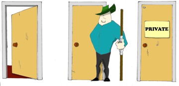

:toc:
:toclevels: 4
:imagesdir: ./

== Chapter 6. Access Levels, Collections, and Generics 

I'll start this chapter with the explanation of how to hide and protect data using so called access level qualifiers. After that we'll experiment with Java collections - the language elements that can store multiple elements of the same type. Remember arrays and their limitations? Java collections offer an alternative to arrays and have other ways of storing similar objects. Finally, you'll get familiar with the mechanism of _generics_ that allows Java compiler to ensure that you won't be using the wrong data types with data collections or other objects.

=== Access Levels 

In code samples from previous chapters I've been using the keyword `public` in declaration of member variables and methods. This means that such a variable or a method can be accesses by any other code from the project. You can declare a class, a method, or a member variable to be `public`, `private`, or `protected`. If one of these keywords is missing, Java compiler assumes that it's a _package access level_ - this element can be access only from the code located in the same package ( directory).

One of the main features of object-oriented languages is _encapsulation_ - an ability to hide and protect data or code. But who do you need to hide or protect the code from? This is not a protection from bad guys who are not allowed to see your code. You hide and protect the code from misuse.

Let's consider an example from the real world. Think of a car – most people have no clue how many parts are there under the hood, and what actually happens when a driver pushes the brake pedal. If car designers would not be hiding control of some of the under-the-hood operations, the driver would have to deal with hundreds of buttons, switches and gauges on the car's dashboard.

[[FIG6-1]]
.The "public user interface" in a car

When you design a  class, hide methods and class member variables that should not be visible from outside. Some of the methods of member variables are meant to be used internally and not to be exposed to other classes.

We'll start learning about hiding and protecting data with the `private` access level. If a variable or a method are declared private, they can be used only within the class where they were declared. The next code sample - it represent a car, and declares some of its elements as `private`. Note that I've created this class in the package `vehicles`.

[source, java]
----
package vehicles;

public class Car {
  
 // This private variable is visible only inside this class
  private String brakesCondition;

 // The public method brake() calls private methods
 // to decide which brakes to use
  public void brake(int pedalPressure){
    boolean useRegularBrakes; 
    useRegularBrakes=
              checkForAntiLockBrakes (pedalPressure);
        
    if (useRegularBrakes==true){
    useRegularBrakes(); 
    }else{
    useAntiLockBrakes();
    }
  }

  // This private method can be called inside 
  // this class only
  private boolean checkForAntiLockBrakes(int pressure){
    if (pressure > 100){
      return true;
    }else {
      return false;
    }
  }

   // This private method can be called inside this   
   // class only
  private void useRegularBrakes(){
   // code that sends a signal to regular brakes
  }

   // This private method can be called inside this 
   // class only
  private void useAntiLockBrakes(){
   // code that sends a signal to anti-lock brakes
   // 
  }
}
----
By looking at this code I can say that the class `Car` exposes only one public method – `brake()`, which internally may invoke several other functions that a driver does not need to know about. For example, if the driver pushes the brakes pedal too hard, the car’s computer may apply special anti-lock brakes implemented in private methods. 

I took the next screenshot in IntelliJ IDEA while writing a class `CarMaster` that uses `Car`. IDEA helps me with suggesting the `Car` class members that I can use in this context. Only the method `brake()` is visible from the class `Car` (other methods are from the class `Object`).

[[FIG6-2]]
.Can use the brake() method only
image::images/fig_6_02.png[]

The `private` access level is the most restrictive one. If you're not sure when to use it, just declare all of your call member variables and methods as private, and loosen this restriction if other classes need to use these members.

[[FIG6-3]]
.Private is the most restrictive access

What do you think will happen if you simply remove the `private` keyword from one of the methods of the class `Car`? Will the `CarMaster` see it? No, it won't because the absence of the access qualifier gives a package access level to this member. Only classes that are located in the package `vehicles` can access it, and `CarMaster` is not one of them.

The class members declared with the `protected` keyword can be accessed from other members of the same class, from its descendants or classes located in the same package. Even if a descendant class is located in a different package, it'll be able to access `protected` methods of its ancestors. 

Some software developer are creating libraries or frameworks of classes to be used by other developers. These classes can be extended, and their creators may use the keyword `protected` trying to allow access to certain member only descendant classes. But in the real world no one can predict what the developer may want to do with there libraries, and the keyword `protected` may become an obstacle in achieving of their goals. I do not use the keyword `protected` in my projects. As you gain more experience with Java, see for yourself if the keyword `protected` brings some value to your programs. 

=== Collections

Now let's see how to work with collections of data. Java  packages `java.util` and `java.util.concurrent` include  classes that are quite handy when a program needs to store several instances of some objects in  memory. There are dozens of collection classes in Java, but I'll just show you a couple of them. Some of the popular collection from the  package `java.util` are `ArrayList`,  `HashTable`, `HashMap`, and `List`. 

The package `java.util.concurrent` has collections that are useful in programs that require concurrent (simultaneous) access to some data by different parts of a program (by multiple _threads_). I'll introduce you briefly to concurrent programming in Chapter 13, but the materials about concurrent collections don't belong to the introductory book like this one.

==== Class ArrayList

In Chapter 4 you got familiar with Java arrays, which have a restriction - you have to specify the number of array elements during the declaration of array. But often you don't know in advance how many elements are there. For example, if you want to write a program that would print all your followers in Twitter, their number may change multiple times a day. The class `java.util.ArrayList` can give you more flexibility - it can grow or shrink in size as needed.

Why use arrays, then?  Let’s just always use `ArrayList`! Unfortunately, nothing  comes for free, and you have to pay the price for having a convenience of dynamically sized arrays. The `ArrayList` objects works is a little slower than a regular array. Besides, you can only store objects there, while arrays allows you to store primitives too.   

To create and populate an `ArrayList` object, you should instantiate it first and then create instances of the objects you are planning to store there. Add each object to the `ArrayList` by calling its method `add()`. The next little program will populate an `ArrayList`  with `String` objects and print the content of this collection.

[source, java]
----
import java.util.ArrayList;

public class ArrayListDemo {
 
  public static void main(String[] args) {
    // Create and populate an ArrayList
    ArrayList friends = new ArrayList();
    friends.add("Mary");
    friends.add("Ann");
    friends.add("David");
    friends.add("Roy");
    
    // How many friends are there?
    int friendsCount = friends.size();  
     
    // Print the content of the ArrayList
    for (int i=0; i<friendsCount; i++){
        System.out.println("Friend #" + i + " is " 
            + friends.get(i));
    }
  }
}
----

This program will print the following:

[source, java]
----
Friend #0 is Mary
Friend #1 is Ann
Friend #2 is David
Friend #3 is Roy
----

The method `get()` extracts the element located at a particular position in the `ArrayList` object. Since you can store any objects in a collection, the method `get()` returns each element as a Java `Object` , and it’s a responsibility of the program to _cast_ this object to a proper data type. We did not have to do it in the previous example only because we stored `String` objects in the collection `friends`, and Java know how to convert an `Object` to a `String` automatically. 

But if you decide to store some other objects in `ArrayList`, for example instances of the class `Fish`, the proper code to add and extract a particular `Fish` may look as in the program `FishTank` that comes next. First, this program creates a couple of instances of the class `Fish`, assigns some value to color, weight and current depth and stores them in the `ArrayList` called `fishTank`. Then, the program gets the objects from this collection, casts them to the class `Fish` and prints their values.

Here’s an output of the program FishTank:

Got the Red fish that weighs 2.0 pounds. Depth:20
Got the Green fish that weighs 5.0 pounds. Depth:10

Now that you’ve read about the Java access levels,  classes Pet and  Fish can be modified a bit. Such variables as age, color, weight and height should be declared  as protected, and the variable currentDepth should be private. You should add  new public methods such as getAge() to return the value of the variable age, and  setAge() has to set the value of this variable, an so on.  

Programmers with good manners do not allow one class directly modify properties of another one – the class should provide methods that  modify its internals.  That’s why the class Score from the previous section was designed with private variables, which could  be changed with setters and getters. 

== Challenge Yourself

